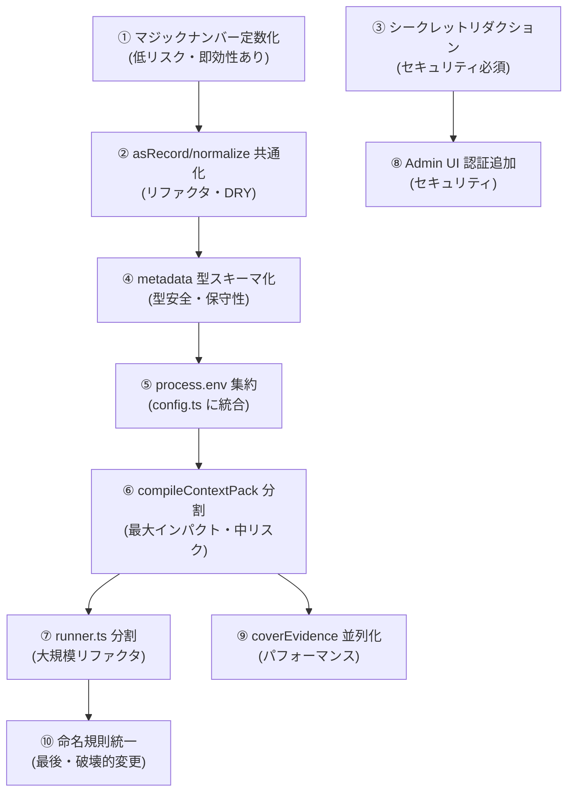

# memory-router エンジニアリング改善提言

> **対象**: memory-router v0.1.0  
> **観点**: コードを実際に読んだ上でのエンジニアリング固有の改善点のみ  
> **除外**: テストカバレッジ・ドキュメント・コミュニティ等の非エンジニアリング項目

---

## 優先度マップ

| 優先 | カテゴリ | 改善点 | 難易度 |
|---:|---|---|:---:|
| 1 | アーキテクチャ | `context-compiler.service.ts` の責務分割 | 中 |
| 2 | アーキテクチャ | `runner.ts` モノファイル問題 | 中 |
| 3 | 設計 | ランキングスコアのマジックナンバー群 | 低 |
| 4 | 設計 | `asRecord` / `normalizeX` ヘルパーの重複定義 | 低 |
| 5 | セキュリティ | シークレット混入防止の未対応 | 中 |
| 6 | パフォーマンス | `coverEvidence` の逐次処理 | 高 |
| 7 | 設計 | `process.env` の散在アクセス | 低 |
| 8 | 設計 | `metadata: Record<string, unknown>` の型ドリフト | 中 |
| 9 | パフォーマンス | コンパイル時の逐次 await 列 | 低 |
| 10 | セキュリティ | Admin UI の認証なし設計 | 中 |

---

## 1. `context-compiler.service.ts` の責務分割 【優先度: 高】

**現状**: [context-compiler.service.ts](file:///Users/y.noguchi/Code/memoryRouter/src/modules/context-compiler/context-compiler.service.ts) は **1,292行・43KB** の単一ファイル。`compileContextPack` 関数1つで800行以上（L794〜L1291）を占め、以下の責務が混在している。

```
compileContextPack() 内の責務混在:
  ├─ 入力正規化・ファセット解決          (L802-834)
  ├─ 設計文書参照検出の早期リターン      (L836-934)
  ├─ Knowledge/Source の並列取得        (L936-946)
  ├─ ランキング + LandscapeIntervention (L950-975)
  ├─ CandidateEvidence フィルタリング    (L978-985)
  ├─ AgenticRefine の呼び出し           (L987-1020)
  ├─ TokenBudget の適用                 (L1039-1056)
  ├─ CandidateTrace の構築・永続化       (L1057-1187)
  ├─ 使用シグナルの記録                  (L1205-1217)
  └─ Compile Run の永続化・Audit記録     (L1132-1288)
```

**改善案**:

```typescript
// Before: 単一の800行関数
export async function compileContextPack(rawInput, options): Promise<...>

// After: 段階ごとの責務分離
class KnowledgeRetrievalPhase    // 取得・フィルタリング・ランキング
class TokenBudgetPhase           // バジェット適用・PackItem構築
class PersistencePhase           // DB永続化・シグナル記録・監査ログ

export async function compileContextPack(rawInput, options): Promise<...> {
  const retrieval = await new KnowledgeRetrievalPhase(input).run();
  const budgeted  = new TokenBudgetPhase(retrieval).apply();
  await new PersistencePhase(budgeted, options).persist();
  return budgeted.toResult();
}
```

---

## 2. `runner.ts` モノファイル問題【優先度: 高】

**現状**: [runner.ts](file:///Users/y.noguchi/Code/memoryRouter/src/modules/distillationPipeline/runner.ts) は **1,147行・35KB** の単一ファイル。`distillationPipeline` モジュール全体がこの1ファイルに集約されており、以下の独立した概念が混在している。

```
runner.ts 内の責務:
  ├─ パイプライン入力型定義              (L56-95)
  ├─ targetKind のフィルタ変換           (L133-155)
  ├─ FindCandidate の並列レーン管理      (L453-630)
  ├─ WebIngest ソース準備               (L642-698)
  ├─ CoverEvidence のチェックポイント実行 (L700-795)
  ├─ エラー時のリース管理                (L1019-1073)
  └─ パイプライン全体のオーケストレーション (L1076-1146)
```

**改善案**:

```
distillationPipeline/
├─ runner.ts              # エントリポイントのみ（〜150行）
├─ find-candidate-lane.ts # 並列FindCandidateレーン
├─ cover-evidence-lane.ts # CoverEvidence + チェックポイント
├─ web-ingest-source.ts   # WebIngestソース準備
└─ lease-manager.ts       # リース管理ユーティリティ
```

---

## 3. ランキングスコアのマジックナンバー群【優先度: 中】

**現状**: [ranking.service.ts](file:///Users/y.noguchi/Code/memoryRouter/src/modules/context-compiler/ranking.service.ts) の `weightedScore` 関数に複数のマジックナンバーが散在している。

```typescript
// Before: 意味が不明瞭な数値の羅列 (ranking.service.ts L22-49)
const baseScore = item.score
  + toUnitKnowledgeScore(item.importance, 0) * 0.2  // なぜ0.2?
  + toUnitKnowledgeScore(item.confidence, 0) * 0.1; // なぜ0.1?
const dynamicBoost   = toUnitKnowledgeScore(item.dynamicScore, 0) * 0.12;
const decayPenalty   = (1 - decayFactor) * 0.12;
const sourceLinkBoost = ... ? 0.05 : 0;
const errorKeywordBoost = Math.min(0.18, ... * 0.03);
const errorFileBoost    = Math.min(0.16, ... * 0.04);
const deprecatedPenalty = item.status === "deprecated" ? 0.5 : 0;
const stalePenalty      = item.stale ? 0.4 : 0;
```

同様に [context-compiler.service.ts](file:///Users/y.noguchi/Code/memoryRouter/src/modules/context-compiler/context-compiler.service.ts) にも:
- `sectionRatios = { rules: 0.55, procedures: 0.45 }` (L44-47)
- `vectorOnlyScoreFloor = 0.52` (L55)
- `normalRankingLimit = 15` (L950)
- `defaultCandidateTraceLimit = 200` (L56)

**改善案**:

```typescript
// After: 名前付き定数 + コメントで根拠を記述
const RANKING_WEIGHTS = {
  /** 重要度スコアの寄与率 */
  importance: 0.2,
  /** 確信度スコアの寄与率 */
  confidence: 0.1,
  /** 動的スコア（利用頻度由来）のブースト上限 */
  dynamicBoost: 0.12,
  /** 時間減衰ペナルティ上限 */
  decayPenalty: 0.12,
  /** ソースリンクを持つ知識へのボーナス */
  sourceLink: 0.05,
  /** deprecated ペナルティ */
  deprecated: 0.5,
} as const;
```

---

## 4. `asRecord` / `normalizeFacetValues` の重複定義【優先度: 中】

**現状**: 以下の同一ロジックが複数のモジュールにコピー定義されている。

```typescript
// 発見箇所（各ファイルに独立定義）:
// context-compiler.service.ts L446-450
// landscape-review-items.service.ts L175-179
// その他の landscape モジュール

function asRecord(value: unknown): Record<string, unknown> {
  return value && typeof value === "object" && !Array.isArray(value)
    ? (value as Record<string, unknown>)
    : {};
}
```

```typescript
// normalizeFacetArray も同様に複数箇所に存在
// context-compiler.service.ts L452-460
// landscape-review-items.service.ts L181-192
```

**改善案**:

```typescript
// src/shared/utils/normalize.ts として共通化
export function asRecord(value: unknown): Record<string, unknown>
export function normalizeFacetArray(values: unknown): string[]
export function normalizeNullableString(value: unknown): string | null
export function toIsoString(value: unknown): string
```

---

## 5. シークレット混入防止【優先度: 高（セキュリティ）】

**現状**: `sync:agent-logs` は会話ログ（`vibe_memories`, `agent_diff_entries`）をそのままDBに取り込む。ログには API キー・パスワード・トークンが含まれる可能性があるが、保存前のリダクション処理が実装されていない。

```typescript
// src/modules/agent-log-sync/ でログをそのまま vibe_memories に保存
// 取り込み前にシークレットパターンのスキャンなし
```

**改善案**:

```typescript
// src/shared/utils/secret-redaction.ts
const SECRET_PATTERNS = [
  /(?:api[_-]?key|token|password|secret)["\s:=]+["']?([A-Za-z0-9_\-\.]{20,})/gi,
  /sk-[A-Za-z0-9]{40,}/g,           // OpenAI-style
  /Bearer\s+[A-Za-z0-9\-._~+\/]+=*/g, // Bearer tokens
];

export function redactSecrets(text: string): string {
  return SECRET_PATTERNS.reduce(
    (result, pattern) => result.replace(pattern, "[REDACTED]"),
    text,
  );
}
```

蒸留ログ (`vibe_memories`) 取り込みとWiki import（`source_fragments`）の両方に適用。

---

## 6. `coverEvidence` の逐次処理ボトルネック【優先度: 高（パフォーマンス）】

**現状**: [runner.ts L780-793](file:///Users/y.noguchi/Code/memoryRouter/src/modules/distillationPipeline/runner.ts) では `candidateIds` を **1件ずつ逐次処理** している。

```typescript
// runner.ts L780-785: 1件ずつ逐次処理（意図的なチェックポイント設計）
const nextCandidateId = pendingCandidateIds[0];
if (nextCandidateId) {
  await runCoverOnce(nextCandidateId);
}
remainingCandidates = Math.max(0, pendingCandidateIds.length - (nextCandidateId ? 1 : 0));
```

1ターゲットに複数候補がある場合（wiki ページに複数の知識候補が抽出される）、候補間に依存関係がないにもかかわらず逐次実行になっている。

**改善案**:

```typescript
// 設定可能な並列度でカバーエビデンスを実行
const COVER_CONCURRENCY = groupedConfig.distillation.coverEvidenceConcurrency ?? 1;

if (COVER_CONCURRENCY > 1) {
  // pendingCandidateIds を COVER_CONCURRENCY 件ずつ並列処理
  for (const batch of chunk(pendingCandidateIds, COVER_CONCURRENCY)) {
    await Promise.all(batch.map(runCoverOnce));
    // チェックポイント: バッチ単位でリース更新
    await heartbeat(target, lease);
  }
}
```

> ⚠️ 注意: チェックポイント設計（途中再開）を壊さないよう、バッチ単位でのハートビート更新が必要。また LLM プロバイダーのレート制限との調整も要考慮。

---

## 7. `process.env` の散在アクセス【優先度: 低】

**現状**: 設定値の取得が `groupedConfig` 経由と `process.env` 直接アクセスの両方が混在している。

```typescript
// context-compiler.service.ts L511-517: process.env を直接参照
function resolveCandidateTraceLimit(): number {
  const raw =
    process.env.MEMORY_ROUTER_CONTEXT_COMPILE_TRACE_LIMIT ??
    process.env.CONTEXT_COMPILE_TRACE_LIMIT;
  ...
}
```

一方で多くの設定は `groupedConfig` を介してアクセスされており、一貫性がない。

**改善案**: `resolveCandidateTraceLimit` のロジックを `src/config.ts` の `groupedConfig.compile` 配下に統合し、`process.env` の直接参照をコア外に追放する。

```typescript
// config.ts に追加
compile: {
  defaultTokenBudget: ...,
  candidateTraceLimit: resolvePositiveInt(
    process.env.MEMORY_ROUTER_CONTEXT_COMPILE_TRACE_LIMIT ?? 
    process.env.CONTEXT_COMPILE_TRACE_LIMIT,
    200,
    { max: 1000, min: 1 }
  ),
}
```

---

## 8. `metadata: Record<string, unknown>` の型ドリフト【優先度: 中】

**現状**: DB の `distillation_target_states.metadata`、`landscape_review_items.payload` 等が `Record<string, unknown>` として保存・取得されており、アクセス時に毎回キャスト・`asRecord()` 呼び出しが必要になっている。

```typescript
// runner.ts L633-639: metadata アクセスのたびにキャスト
const metadata =
  target.metadata && typeof target.metadata === "object"
    ? (target.metadata as Record<string, unknown>)
    : {};
const sourceUrl = typeof metadata.sourceUrl === "string" ? metadata.sourceUrl.trim() : "";
```

このパターンがコードベース全体に散在（推定 30+ 箇所）。

**改善案**: 各エンティティのメタデータに Zod スキーマを定義し、読み取り時にバリデーション・型変換を一元化する。

```typescript
// src/shared/schemas/distillation-target-metadata.schema.ts
export const webIngestTargetMetadataSchema = z.object({
  sourceUrl: z.string().optional(),
  savedWikiTargetKey: z.string().optional(),
  savedWikiSlug: z.string().optional(),
  // ...
});

// 読み取り時:
const meta = webIngestTargetMetadataSchema.safeParse(target.metadata);
const sourceUrl = meta.success ? meta.data.sourceUrl ?? "" : "";
```

---

## 9. コンパイル時の逐次 await 列【優先度: 低〜中（パフォーマンス）】

**現状**: [context-compiler.service.ts L1132-1218](file:///Users/y.noguchi/Code/memoryRouter/src/modules/context-compiler/context-compiler.service.ts) の正常パスで、独立した非同期処理が **逐次** で実行されている。

```typescript
// L1132-1217: 依存関係のない処理が順番待ち
const runId = await insertCompileRun(...);
await persistCompileTaskTraceSafe(...);
await insertContextPackItems(runId, ...);
const candidateTracePersistResult = await persistCandidateTraceRows(...);
await recordKnowledgeCompileSelectionSafe(...);
await recordCompileRunKnowledgeUsageSignalsSafe(...);
```

`insertContextPackItems`・`persistCandidateTraceRows`・`recordKnowledgeCompileSelectionSafe` は `runId` に依存するが、相互には独立している。

**改善案**:

```typescript
const runId = await insertCompileRun(...);
await persistCompileTaskTraceSafe(...);

// 依存のない3処理を並列化
const [candidateTracePersistResult] = await Promise.all([
  persistCandidateTraceRows({ runId, rows: candidateTraceRows, traceLimit }),
  insertContextPackItems(runId, ...),
  recordKnowledgeCompileSelectionSafe({ runId, ... }),
]);

// usage signals は fire-and-forget
void recordCompileRunKnowledgeUsageSignalsSafe(...).catch(() => undefined);
```

---

## 10. Admin UI の認証なし設計【優先度: 中（セキュリティ）】

**現状**: Admin UI の Hono REST API には認証・認可が一切ない。ローカル単体利用では問題ないが、開発チームで共有したり、リバースプロキシ越しに公開した場合に全 knowledge が無防備になる。

**改善案（段階的）**:

```typescript
// 段階1: 環境変数ベースのシンプルなAPIキー認証
// api/middleware/auth.ts
export function apiKeyAuth(): MiddlewareHandler {
  const key = process.env.MEMORY_ROUTER_ADMIN_API_KEY;
  if (!key) return (_, next) => next(); // キー未設定時はスキップ（後方互換）
  return async (ctx, next) => {
    const provided = ctx.req.header("x-admin-api-key") ?? ctx.req.query("api_key");
    if (provided !== key) {
      return ctx.json({ error: "unauthorized" }, 401);
    }
    return next();
  };
}
```

```typescript
// 段階2: MEMORY_ROUTER_ALLOWED_ORIGINS での CORS 制限
// 段階3: mTLS or SSH tunnel での本番隔離
```

---

## 横断的改善: 命名規則の統一

**現状**: ディレクトリ命名に `kebab-case`（`context-compiler`）と `camelCase`（`distillationPipeline`, `findCandidate`, `coverEvidence`）が混在している。

```
src/modules/
├── context-compiler/    ← kebab-case
├── distillationPipeline/ ← camelCase
├── findCandidate/        ← camelCase
├── coverEvidence/        ← camelCase
├── finalizeDistille/     ← camelCase
├── vibe-memory/          ← kebab-case
├── agent-log-sync/       ← kebab-case
```

**改善案**: `kebab-case` に統一（Node.js/TypeScript エコシステムの慣例）。リネームはIDEのシンボルリネームで安全に実施できる。

---

## 改善優先順位（実施推奨順）



> **開始推奨**: ①②⑤はリスクが低く即日着手可能。③はセキュリティリスクが現実的なためPRとして早期に対応推奨。⑥⑦は大規模リファクタのため、十分なブランチ期間を確保してから実施。
