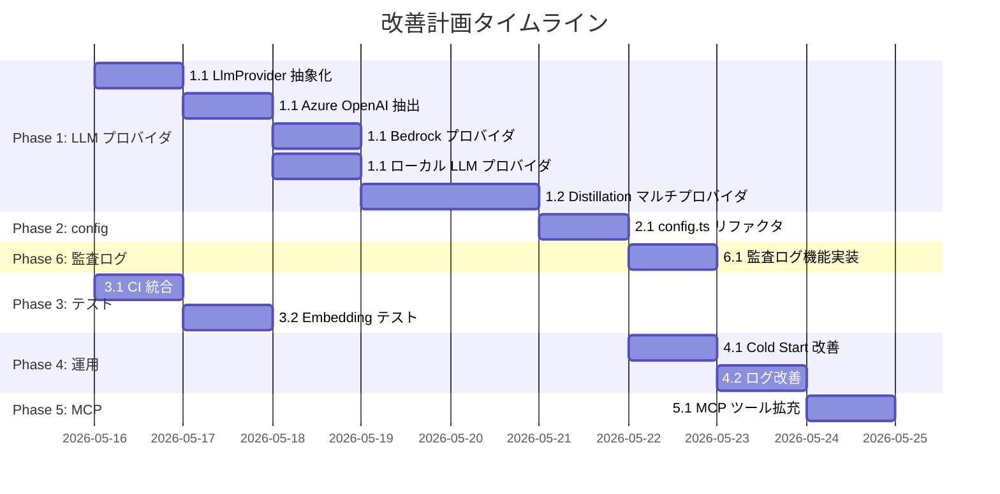

# memory-router 改善計画

> **作成日**: 2026-05-15
> **バージョン**: 0.1.0
> **前提**: ローカル実行専用。ホスティング・パブリック公開は対象外。

---

## 前提条件と制約

| 項目 | 方針 |
|---|---|
| **PostgreSQL + pgvector** | 必須依存。vector embedding を使う以上、代替（SQLite 等）は検討しない |
| **セキュリティ** | ローカル実行前提で十分。API 認証・認可は不要 |
| **ホスティング** | 考慮しない。Docker Compose はローカル DB 用のみ |
| **LLM プロバイダ** | Azure OpenAI 以外に **Bedrock**、**Gemma4 (ローカル)** をサポートする |

---

## Phase 1: LLM プロバイダ抽象化（最優先）

### 1.1 Agentic Compile のマルチプロバイダ対応

**現状の問題**

`agentic-refine.service.ts` は Azure OpenAI にハードコードされている：
- `buildAzureOpenAiUrl()` — Azure 固有の URL 構築
- `callAzureOpenAi()` — Azure 固有のヘッダー（`api-key`）
- `checkAzureOpenAiHealth()` — Azure 固有のヘルスチェック
- `config.azureOpenAi*` — Azure 専用の設定群

**目標**

Agentic Compile で以下の3プロバイダを選択可能にする：

| プロバイダ | 用途 | 認証 |
|---|---|---|
| **Azure OpenAI** | 既存。GPT-4o 等 | `api-key` ヘッダー |
| **AWS Bedrock** | Claude, Nova 等 | AWS Signature V4 / プロファイル |
| **ローカル LLM** | Gemma4 等。既存の distillation runtime を再利用 | Bearer token (任意) |

**タスク**

- [ ] `src/modules/llm/` ディレクトリを新設し、プロバイダ抽象を定義する
  ```typescript
  // src/modules/llm/llm-provider.ts
  export type LlmChatRequest = {
    messages: Array<{ role: "system" | "user" | "assistant"; content: string }>;
    maxTokens: number;
    temperature?: number;
    responseFormat?: "json" | "text";
  };

  export type LlmChatResponse = {
    content: string;
    finishReason?: string;
  };

  export type LlmProvider = {
    name: string;
    chat(request: LlmChatRequest): Promise<LlmChatResponse>;
    healthCheck(): Promise<{ reachable: boolean; error?: string }>;
  };
  ```
- [ ] Azure OpenAI プロバイダを既存コードから抽出する
  - `src/modules/llm/providers/azure-openai.provider.ts`
  - `buildAzureOpenAiUrl()`, `callAzureOpenAi()` をそのまま移動
- [ ] Bedrock プロバイダを新規実装する
  - `src/modules/llm/providers/bedrock.provider.ts`
  - `@aws-sdk/client-bedrock-runtime` を使用
  - `AWS_PROFILE` / `AWS_REGION` / `MEMORY_ROUTER_BEDROCK_MODEL` で設定
- [ ] ローカル LLM プロバイダを追加する
  - `src/modules/llm/providers/local-llm.provider.ts`
  - 既存の `distillation-runtime.service.ts` の `callLocalLlmChat()` を再利用
  - tool_calls は agentic compile では不要なので、chat-only のラッパー
- [ ] `config.ts` に `agenticCompile.provider` を追加する
  ```
  MEMORY_ROUTER_CONTEXT_COMPILE_AGENTIC_PROVIDER=azure-openai|bedrock|local-llm|auto
  ```
  - `auto`: Azure → Bedrock → ローカル LLM の順でフォールバック
- [ ] `agentic-refine.service.ts` を LlmProvider 経由に書き換える
- [ ] Doctor の `azureOpenAi` セクションを `agenticLlm` に汎化する
- [ ] `.env.example` を更新する

**設定例**

```bash
# Azure OpenAI (既存)
MEMORY_ROUTER_CONTEXT_COMPILE_AGENTIC_PROVIDER=azure-openai
MEMORY_ROUTER_AZURE_OPENAI_API_KEY=xxx
MEMORY_ROUTER_AZURE_OPENAI_API_BASE_URL=https://xxx.openai.azure.com

# AWS Bedrock
MEMORY_ROUTER_CONTEXT_COMPILE_AGENTIC_PROVIDER=bedrock
MEMORY_ROUTER_BEDROCK_MODEL=anthropic.claude-sonnet-4-20250514-v1:0
MEMORY_ROUTER_BEDROCK_REGION=us-east-1

# ローカル Gemma4 (既存 distillation LLM を共用)
MEMORY_ROUTER_CONTEXT_COMPILE_AGENTIC_PROVIDER=local-llm
# → config.localLlm.apiBaseUrl / config.localLlm.model を使用
```

**受け入れ条件**

- 3 プロバイダが設定だけで切り替わる
- Azure OpenAI の既存動作が regression しない
- Doctor でプロバイダの疎通状態が確認できる
- `bun run verify` が通る

**関連ファイル**

- [agentic-refine.service.ts](../src/modules/context-compiler/agentic-refine.service.ts)
- [distillation-runtime.service.ts](../src/modules/distillation/distillation-runtime.service.ts)
- [doctor.service.ts](../src/modules/doctor/doctor.service.ts)
- [config.ts](../src/config.ts)

---

### 1.2 Distillation LLM のプロバイダ選択

**現状の問題**

`distillation-runtime.service.ts` はローカル LLM（OpenAI 互換 API）にハードコード。
ローカル LLM がない環境では蒸留が実行できない。

**目標**

蒸留にも Bedrock / Azure OpenAI を使えるようにする。

**タスク**

- [ ] 1.1 の `LlmProvider` を蒸留にも適用する
  - ただし蒸留は **tool_calls** 対応が必要なため、`LlmProvider` に `chatWithTools()` を追加するか、蒸留専用の拡張インターフェースを用意する
- [ ] `config.ts` に `distillation.provider` を追加する
  ```
  MEMORY_ROUTER_DISTILLATION_PROVIDER=local-llm|azure-openai|bedrock|auto
  ```
  - デフォルト: `local-llm`（既存動作を維持）
- [ ] Bedrock プロバイダで tool_calls の converse API マッピングを実装する
- [ ] テストの `chatClient` mock が引き続き動作することを確認する

**受け入れ条件**

- 既存のローカル LLM 蒸留が regression しない
- Bedrock / Azure OpenAI でも蒸留が動作する（tool_calls 含む）
- `bun run verify` が通る

**関連ファイル**

- [distillation-runtime.service.ts](../src/modules/distillation/distillation-runtime.service.ts)
- [distillation-tools.service.ts](../src/modules/distillation/distillation-tools.service.ts)
- [config.ts](../src/config.ts)

---

## Phase 2: config.ts リファクタリング

### 2.1 Object.defineProperties の段階的廃止

**現状の問題**

`config.ts` が 849 行。`groupedConfig` は既に導入済みだが、`Object.defineProperties` による flat alias が ~400 行を占めている。

**タスク**

- [ ] 消費側モジュールを `groupedConfig.xxx.yyy` に段階的に移行する
  - 優先: 新規コード（Phase 1 の LLM プロバイダ）は最初から `groupedConfig` を参照
  - 次: `src/modules/` 配下を 1 モジュールずつ移行
  - 最後: `test/` の mock を更新
- [ ] 全消費側が移行完了したら `Object.defineProperties` ブロックと `FlatConfig` 型を削除する
- [ ] `config` export を `groupedConfig` に置き換える（エイリアス維持は不要）

**受け入れ条件**

- `config.ts` が 400 行以下になる
- flat alias が 0 件
- `bun run verify` が通る

**関連ファイル**

- [config.ts](../src/config.ts)
- [constants.ts](../src/constants.ts)

---

## Phase 3: テスト・品質基盤

### 3.1 CI 統合 (GitHub Actions)

**タスク**

- [ ] `.github/workflows/verify.yml` を作成する
  - `bun run verify` を push / PR で実行
  - PostgreSQL + pgvector は `ankane/pgvector` Docker image で起動
  - integration test は別 job で `bun run test:integration` を実行
- [ ] README に CI バッジを追加する

**受け入れ条件**

- push / PR で typecheck + lint + format + unit test + web build が自動実行される
- integration test が CI 上の test DB で動作する

---

### 3.2 Embedding テストの改善

**現状の問題**

`embedding.service.ts` は daemon / CLI の 2 プロバイダを持つが、テストカバレッジが薄い。特に `auto` モードのフォールバック動作が十分にテストされていない。

**タスク**

- [ ] daemon 失敗 → CLI フォールバックの unit test を追加する
- [ ] `disabled` モードの明示テストを追加する
- [ ] dimension mismatch の検証テストを追加する

**受け入れ条件**

- `auto` モードの全フォールバックパスがテストされる
- `bun run test:unit` に含まれる

**関連ファイル**

- [embedding.service.ts](../src/modules/embedding/embedding.service.ts)
- [embedding.service.test.ts](../test/embedding.service.test.ts)

---

## Phase 4: 運用改善

### 4.1 Cold Start 体験の磨き込み

**現状**

`bun run init:project` は既に実装済みだが、初回体験をさらに改善する余地がある。

**タスク**

- [ ] `init:project` の出力に、次にやるべきことを明示する
  - 蒸留の推奨（`distill:sources --apply`）
  - MCP 設定の案内（agent 設定ファイルへのコピペ用 JSON）
  - Doctor でのヘルスチェック
- [ ] README の Quick Start を「5 分で価値を体感」に最適化する
  - `git clone → bun install → docker compose up -d → bun run db:migrate → bun run init:project` のワンライナー化
- [ ] smoke compile の結果が 0 件の場合、具体的な次のアクションを表示する

**受け入れ条件**

- 新規ユーザーが README の Quick Start だけで `context_compile` まで到達できる
- `init:project` の出力が self-documenting

---

### 4.2 ログ・診断の改善

**タスク**

- [ ] 蒸留・同期の実行ログを構造化する（JSON ログ出力オプション）
  - LaunchAgent 経由の実行でログ解析が容易になる
- [ ] Doctor に「最終成功 distillation からの経過時間」を追加する（既に一部実装済み、表示の改善）
- [ ] compile diagnostics に `cacheKeyDraft` を含める（既に実装済み、Doctor 側での表示を改善）

**受け入れ条件**

- `--json` フラグで構造化ログが出力される
- Doctor レポートで automation の健全性が一目で分かる

---

## Phase 5: MCP ツール拡充

### 5.1 Knowledge 管理の MCP ツール追加

**タスク**

- [ ] `update_knowledge` ツールの追加を検討する
  - status 変更（draft → active, active → deprecated）
  - body / title の修正
  - エージェントが自律的にナレッジを管理できるようにする
- [ ] `list_knowledge` ツールの追加を検討する
  - draft backlog の確認
  - 特定 repo の active knowledge 一覧

**受け入れ条件**

- 既存の `register_knowledge` / `search_knowledge` との一貫性が維持される
- MCP tool contract doc が更新される

**関連ファイル**

- [knowledge.tool.ts](../src/mcp/tools/knowledge.tool.ts)
- [mcp-tools.md](../docs/mcp-tools.md)

---

## Phase 6: 監査ログ（Audit Log）機能

### 6.1 監査ログの保存と自動クリーンアップ

**目標**

システムの重要なアクションを「監査ログ」として記録し、直近7日分の履歴を保持する。

**タスク**

- [ ] `audit_logs` テーブルを DB に追加する
  ```sql
  CREATE TABLE audit_logs (
    id uuid PRIMARY KEY DEFAULT gen_random_uuid(),
    event_type text NOT NULL, -- KNOWLEDGE_CREATED, DISTILL_RUN, COMPILE_RUN, etc.
    actor text NOT NULL,      -- agent, user, system
    payload jsonb,            -- 関連データ（id, summary等）
    created_at timestamp DEFAULT now()
  );
  ```
- [ ] 以下の重要イベントにログ記録処理を挿入する
  - Knowledge: 登録、更新、ステータス変更（昇格/降格）
  - Distillation: 実行開始、終了（成功/失敗）
  - Context Compile: 実行（goal, retrievalMode）
  - Sync: ログ同期実行
  - Source: インポート、更新
- [ ] 7日以上前のログを自動削除する cleanup 処理を実装する
  - `doctor` 実行時または `sync` 実行時にトリガー

### 6.2 監査ログ閲覧 UI

**目標**

Admin UI で「何が起きたか」を時系列で確認できるようにする。

**タスク**

- [ ] `GET /api/audit-logs` API を実装する（ページネーション、タイプフィルタ付き）
- [ ] Admin セクションに「Audit Logs」ページを新設する
  - TanStack Table を使用した時系列表示
  - イベントタイプによるフィルタリング
  - 詳細情報の JSON 表示（Modal または Side Panel）

**受け入れ条件**

- 重要アクションが漏れなく `audit_logs` テーブルに記録される
- UI から直近のイベント履歴が確認できる
- 7日経過した古いログが自動的に削除される
- `bun run verify` が通る

---

## 優先度マトリクス

| Phase | 項目 | 優先度 | 工数見積 | 依存関係 |
|---|---|---|---|---|
| 1.1 | Agentic Compile マルチプロバイダ | **最優先** | 2-3日 | なし |
| 1.2 | Distillation マルチプロバイダ | **最優先** | 1-2日 | 1.1 の LlmProvider |
| 2.1 | config.ts リファクタ | 高 | 1日 | 1.1 完了後が効率的 |
| 6.1 | 監査ログ機能 | 高 | 1日 | DB マイグレーション |
| 3.1 | CI 統合 | 高 | 0.5日 | なし（並行可能） |
| 3.2 | Embedding テスト改善 | 中 | 0.5日 | なし（並行可能） |
| 4.1 | Cold Start 体験改善 | 中 | 0.5日 | なし |
| 4.2 | ログ・診断改善 | 低 | 0.5日 | なし |
| 5.1 | MCP ツール拡充 | 低 | 1日 | なし |

---

## 実装順序の推奨



---

## 対象外（明示的に除外するもの）

| 項目 | 理由 |
|---|---|
| SQLite 対応 | pgvector 必須のため不要 |
| API 認証・認可 | ローカル実行専用のため不要 |
| HTTPS / TLS | ローカル実行専用のため不要 |
| サーバーホスティング対応 | スコープ外 |
| マルチテナント | ローカル単一ユーザーのため不要 |
| Rate limiting | ローカル実行専用のため不要 |
