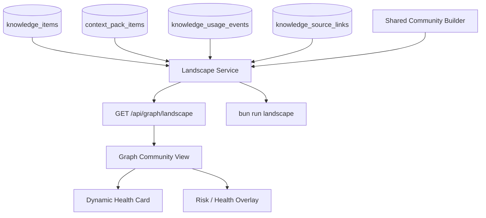

# Knowledge Landscape Attractor 実装計画

> Status: implementation plan
> Date: 2026-05-24 JST
> Based on: `docs/knowledge-landscape-concept-design.md`

## 1. 目的

Attractor / Negative Attractor / Dead Zone を、既存 DB と既存 Graph Community View から導出される read-only な `Landscape Snapshot` として実装する。

この計画のゴールは、前回レビューの各評点を 9 点水準へ引き上げることである。

| 評価観点 | 9 点にするための設計条件 |
| --- | --- |
| memoryRouter の思想との適合 | `observe first -> explain -> replay -> rank` を守り、ranking や自動補正には入れない |
| 現在の実データに対する必要性 | zero-use / dead zone を第一級指標にし、feedback が少ない状態でも価値が出るようにする |
| Phase 1 の実装妥当性 | 既存 community view と feedback schema を再利用し、DB migration なしで API / CLI / UI を段階実装する |
| Negative Attractor の即時有用性 | `off_topic` / `wrong` が少ない間は「確定」ではなく `candidate` と `feedback_insufficient` を明示する |
| UI overlay の優先度 | 派手な演出より、community detail に Dynamic Health Card を先に置き、必要なリスクだけ視覚強調する |

## 2. 基本方針

### 2.1 Read-only を固定する

Phase 1 では次を行わない。

- `context_compile` ranking の変更
- `knowledge_items` への `community_id` 保存
- query embedding の永続化
- Attractor / Basin / Field 用の新規 primary table 追加
- `appliesTo` 自動修正
- candidate promotion gate への反映
- exploration / diversity boost の実 compile 投入

Phase 1 は観測、説明、運用レビューのためのスナップショットに限定する。

### 2.2 `community` と `attractor` を分離する

実装上の単位名を混同しない。

```txt
community
= Graph edge から導出された構造的まとまり

landscape unit
= Phase 1 で分析対象にする単位。初期値は community

attractor candidate
= compile / feedback 履歴から、選出と有効利用が観測された landscape unit

negative attractor candidate
= よく選ばれるが off_topic / wrong が観測された landscape unit
```

API の返却では `communityId` と `classification` を分ける。`community` であることを理由に attractor と呼ばない。

### 2.3 `not_used` は negative にしない

現行 verdict は `used | not_used | off_topic | wrong` である。

`not_used` は「選ばれたが最終出力に使われた証拠がない」状態であり、`off_topic` ではない。Phase 1 では次の扱いにする。

- `used`: positive signal
- `not_used`: neutral signal
- `off_topic`: negative signal
- `wrong`: review-required risk signal

`not_used` が多い場合は `over_selected_not_used` として表示するが、Negative Attractor のスコアには混ぜない。

### 2.4 期間集計と累積集計を混ぜない

`knowledge_items.compile_select_count` は累積値である。30 日の Activity や AttractorScore には、`context_pack_items.created_at` を使った window 集計を使う。

累積値は次の用途に限定する。

- all-time support signal
- zero-use 判定の補助
- existing Graph Community Summary との互換表示

Phase 1 の scoring では、window 指標と all-time 指標を別フィールドに分ける。

### 2.5 Decay の向きを修正する

既存 `computeDecayFactor` は新しい知識ほど `1` に近い値を返す。したがって実装では `Decay(C)` という曖昧な名前を使わず、次の名前にする。

```txt
freshnessFactor = avg(computeDecayFactor(...))
stalenessFactor = 1 - freshnessFactor
```

AttractorScore は `freshnessFactor` を掛ける。`1 - freshnessFactor` を掛けて新しい知識を不利にしない。

## 3. Phase 1 の成果物

### 3.1 Backend

- `src/modules/landscape/landscape.types.ts`
- `src/modules/landscape/landscape.scoring.ts`
- `src/modules/landscape/landscape.repository.ts`
- `src/modules/landscape/landscape.service.ts`
- `src/shared/schemas/landscape.schema.ts`
- `GET /api/graph/landscape`

### 3.2 CLI

まず repo-local script として追加する。

- `src/cli/landscape.ts`
- `package.json` script: `landscape`

コマンド名は初期実装では次にする。

```bash
bun run landscape -- --window-days 30
bun run landscape -- --window-days 30 --json
```

`memory-router landscape` を名乗る場合は、別途 `bin` entry と dispatcher を実装してから README に書く。存在しない CLI 名を成果物として記述しない。

### 3.3 Web UI

- `web/src/modules/admin/repositories/admin.repository.ts`
  - `fetchLandscapeSnapshot`
  - Landscape 型追加
- `web/src/modules/admin/components/graph.page.tsx`
  - Community view 時だけ Landscape Snapshot を取得
  - Dynamic Health Card を detail panel に表示
  - overlay 表示は最小限から開始
- `web/src/styles.css`
  - attractor halo
  - negative candidate outline
  - dead zone muted / dashed style

## 4. Architecture



### 4.1 Shared Community Builder

現行の community assignment は `api/modules/graph/graph.repository.ts` 内の private helper に閉じている。Landscape Service と Graph API の両方で同じ community を見るため、まず read-only helper を共有層へ切り出す。

候補:

- `src/modules/graph/community-builder.ts`
- `src/modules/graph/graph-snapshot.types.ts`

移動対象:

- community assignment
- community key hash
- community summary の型、または最低限の member mapping
- relation axes parsing は API 側に残す。ただし service 入力型は `GraphRelationAxis[]` を受け取る

この抽出で既存 `GET /api/graph` の response を変えない。

### 4.2 Landscape Service の責務

`buildLandscapeSnapshot(input)` は以下を行う。

1. 既存 community builder から community と member knowledge ids を取得する
2. window 内の `context_pack_items` から selected count を集計する
3. window 内の `knowledge_usage_events` から verdict count を集計する
4. `knowledge_items` から status / type / importance / confidence / dynamicScore / freshness を集計する
5. source evidence density を `knowledge_source_links` と既存 metadata source refs から集計する
6. scoring と classification を行う
7. API / CLI / UI が同じ JSON を使える形で返す

Landscape Service は DB 更新をしない。

## 5. API contract

### 5.1 Endpoint

```txt
GET /api/graph/landscape
```

Query:

| parameter | default | note |
| --- | --- | --- |
| `windowDays` | `30` | `1..180` |
| `limit` | `1000` | graph と同じ上限 |
| `status` | `active` | `current | active | draft | deprecated | all` |
| `relationAxes` | `session,project,source` | community basis |
| `minSelectedCount` | `3` | attractor candidate の最低 activity |
| `minFeedbackCount` | `3` | feedback insufficient 判定 |
| `format` | `full` | 将来 `summary` を追加可能 |

### 5.2 Response

```ts
type LandscapeSnapshot = {
  generatedAt: string;
  windowDays: number;
  basis: {
    unit: "community";
    relationAxes: Array<"session" | "project" | "source">;
    status: "current" | "active" | "draft" | "deprecated" | "all";
  };
  thresholds: LandscapeThresholds;
  stats: LandscapeStats;
  communities: LandscapeCommunity[];
  risks: LandscapeRisk[];
};
```

`LandscapeCommunity`:

```ts
type LandscapeCommunity = {
  communityId: string;
  communityKey: string;
  communityLabel: string;
  communityRank: number;
  size: number;

  memberCounts: {
    active: number;
    draft: number;
    deprecated: number;
    rule: number;
    procedure: number;
    embedded: number;
  };

  selection: {
    selectedItemCountWindow: number;
    selectedRunCountWindow: number;
    cumulativeCompileSelectCount: number;
    zeroUseActiveCount: number;
    zeroUseActiveRatio: number;
  };

  feedback: {
    usedCountWindow: number;
    notUsedCountWindow: number;
    offTopicCountWindow: number;
    wrongCountWindow: number;
    feedbackCountWindow: number;
    usedRate: number;
    notUsedRate: number;
    offTopicRate: number;
    wrongRate: number;
    feedbackConfidence: "insufficient" | "low" | "medium" | "high";
  };

  quality: {
    avgImportance: number;
    avgConfidence: number;
    avgDynamicScore: number;
    sourceRefCount: number;
    sourceRefDensity: number;
    avgFreshnessFactor: number;
    avgStalenessFactor: number;
  };

  scores: {
    activity: number;
    attractorScore: number;
    negativeScore: number;
    reachabilityRiskScore: number;
  };

  classification: {
    primary:
      | "strong_attractor"
      | "useful_attractor"
      | "negative_attractor_candidate"
      | "over_selected_not_used"
      | "dead_zone_reachability_risk"
      | "dead_zone_stale"
      | "feedback_insufficient"
      | "neutral";
    flags: string[];
    confidence: "low" | "medium" | "high";
    reason: string;
  };

  representativeKnowledgeIds: string[];
};
```

## 6. Scoring v1

### 6.1 Activity

```txt
Activity(C) = selectedItemCountWindow(C)
```

`selectedItemCountWindow` は `context_pack_items` 由来とする。`compile_select_count` は累積補助値にする。

### 6.2 Feedback confidence

```txt
feedbackCount = used + not_used + off_topic + wrong

insufficient: feedbackCount < minFeedbackCount
low:          minFeedbackCount <= feedbackCount < 10
medium:       10 <= feedbackCount < 30
high:         30 <= feedbackCount
```

`feedback_insufficient` の community は attractor / negative attractor を確定表示しない。ただし selected count や zero-use は表示する。

### 6.3 AttractorScore

```txt
positiveRate = usedCountWindow / max(1, used + not_used + off_topic + wrong)
evidenceFactor = clamp(sourceRefDensity / 1.0, 0.25, 1.25)
freshnessFactor = avgFreshnessFactor
feedbackFactor = feedbackConfidenceFactor

AttractorScore =
  selectedItemCountWindow
  * positiveRate
  * evidenceFactor
  * freshnessFactor
  * feedbackFactor
```

`feedbackConfidenceFactor`:

```txt
insufficient = 0.4
low = 0.7
medium = 0.9
high = 1.0
```

`agenticAcceptCount` は Phase 1 では score へ混ぜない。現行列が all-time counter であり、window 指標と混ぜると説明性が落ちるためである。必要になったら Phase 2 で window 化した acceptance signal を追加する。

### 6.4 NegativeScore

```txt
negativeWeighted =
  offTopicCountWindow * 1.0
  + wrongCountWindow * 3.0

negativeRate = negativeWeighted / max(1, feedbackCount)

NegativeScore =
  selectedItemCountWindow
  * negativeRate
  * feedbackFactor
```

`not_used` は入れない。

`wrongCountWindow > 0` の場合は score に加えて `wrong_review_required` flag を付ける。

### 6.5 ReachabilityRiskScore

Dead Zone は削除候補ではなく、まず到達性レビュー対象にする。

```txt
zeroUseActiveRatio = zeroUseActiveCount / max(1, activeCount)

sourceEvidenceFactor =
  sourceRefDensity >= 1.0 ? 1.0 :
  sourceRefDensity >= 0.5 ? 0.6 :
  0.2

qualityPotential =
  avg(avgImportance, avgConfidence) / 100

ReachabilityRiskScore =
  zeroUseActiveRatio
  * sourceEvidenceFactor
  * qualityPotential
  * embeddedRatio
```

分類:

- `dead_zone_reachability_risk`: active があり、window/all-time ともほぼ未使用で、source evidence / confidence / embedding がある
- `dead_zone_stale`: active があり未使用だが、source evidence が薄く、freshness も低い
- `neutral`: zero-use だが niche の可能性が高く、削除や修正に進む根拠が足りない

## 7. Classification rules

上から順に評価する。

1. `negative_attractor_candidate`
   - `selectedItemCountWindow >= minSelectedCount`
   - `feedbackConfidence !== insufficient`
   - `offTopicRate >= 0.4` または `wrongCountWindow > 0`
2. `over_selected_not_used`
   - `selectedItemCountWindow >= minSelectedCount`
   - `notUsedRate >= 0.6`
   - `offTopicCountWindow = 0`
   - `wrongCountWindow = 0`
3. `strong_attractor`
   - `selectedItemCountWindow >= minSelectedCount`
   - `feedbackConfidence >= medium`
   - `usedRate >= 0.7`
   - `sourceRefDensity >= 0.6`
4. `useful_attractor`
   - `selectedItemCountWindow >= minSelectedCount`
   - `usedRate >= 0.5`
   - negative flags がない
5. `dead_zone_reachability_risk`
   - `activeCount > 0`
   - `selectedItemCountWindow = 0`
   - `cumulativeCompileSelectCount = 0`
   - `ReachabilityRiskScore >= 0.3`
6. `dead_zone_stale`
   - `activeCount > 0`
   - `selectedItemCountWindow = 0`
   - `sourceRefDensity < 0.5`
   - `avgStalenessFactor >= 0.5`
7. `feedback_insufficient`
   - selected はあるが feedback が少ない
8. `neutral`

Threshold は `landscape.scoring.ts` の定数としてまとめ、API response の `thresholds` に必ず返す。

## 8. Implementation milestones

### Milestone 0: Community builder extraction

目的: Graph と Landscape が同じ community basis を共有する。

作業:

- `api/modules/graph/graph.repository.ts` から community assignment の pure helper を共有層へ移動
- 既存 `GET /api/graph` の response を変えない
- 既存 graph community tests をそのまま通す

完了条件:

- `test/repositories.integration.test.ts` の community view tests が通る
- `test/components/admin/graph-page.test.tsx` の community tests が通る
- API response diff が意図せず変わらない

### Milestone 1: Landscape scoring core

目的: UI なしで Landscape Snapshot を構築できる。

作業:

- `LandscapeSnapshot` 型と zod schema を追加
- window 集計 repository を追加
- scoring / classification を pure function として実装
- fixture unit tests を追加

重点テスト:

- `not_used` が NegativeScore に入らない
- `freshnessFactor` の向きが正しい
- feedback insufficient では negative を確定しない
- `compile_select_count` ではなく `context_pack_items.created_at` で window activity を見る
- zero-use active + source evidence で `dead_zone_reachability_risk` になる

### Milestone 2: API and CLI

目的: 実データから read-only snapshot を取得できる。

作業:

- `GET /api/graph/landscape` を追加
- `src/cli/landscape.ts` を追加
- `package.json` に `landscape` script を追加
- CLI は table summary と `--json` の両方を持つ

CLI 表示例:

```txt
Landscape Snapshot (30d, active)
Communities: 99
Strong attractors: 4
Negative candidates: 0
Over-selected not used: 3
Dead reachability risks: 50
Feedback insufficient: 22
```

完了条件:

- API unit / route tests が通る
- CLI smoke test が通る
- 実 DB で `bun run landscape -- --json` が valid schema を返す

### Milestone 3: Graph UI integration

目的: Community view で Dynamic Health Card を読める。

作業:

- `fetchLandscapeSnapshot` を admin repository に追加
- `viewMode === "community"` のときだけ snapshot を fetch
- `communityKey` で `GraphCommunitySummary` と `LandscapeCommunity` を紐付ける
- detail panel に Dynamic Health Card を追加
- supernode mode でも selected community の health を表示する

Dynamic Health Card 表示項目:

- primary classification
- selected count window
- used / not_used / off_topic / wrong
- feedback confidence
- zero-use active ratio
- source evidence density
- recommended review action

Overlay 表示:

- `strong_attractor`: halo
- `negative_attractor_candidate`: red outline。feedback insufficient の場合は赤を使わない
- `dead_zone_reachability_risk`: muted + dashed
- `over_selected_not_used`: amber outline

完了条件:

- Graph component tests に Dynamic Health Card 表示を追加
- long label / small viewport で detail panel が破綻しない
- Community view 以外では余計な fetch をしない

### Milestone 4: Live calibration

目的: 現在の local DB で意味のある分類になっているか確認する。

作業:

- `bun run doctor`
- `bun run landscape -- --window-days 30`
- `bun run landscape -- --window-days 30 --json`
- active/current/all の結果比較
- top risks の representative knowledge を手動で数件確認

確認観点:

- zero-use active の多さが Dead Zone として説明できている
- feedback が少ない場合に Negative Attractor を過剰表示していない
- source evidence がある未使用 community と、source が薄い stale community が分かれている
- strong attractor が単なる大 community になっていない

### Milestone 5: Documentation and closeout

目的: 運用者がこの機能を正しく使える状態にする。

作業:

- README の API / scripts に `landscape` を追加
- `docs/knowledge-landscape-concept-design.md` から実装計画へのリンクを追加
- `docs/graph-community-view-mvp-plan.md` には、Landscape overlay が後続実装である旨を追記する

完了条件:

- `bun run typecheck`
- `bun run lint`
- `bun run format:check`
- `bun run test:unit`
- `bun run build:web`
- 可能なら `bun run test:integration`

## 9. File-level implementation map

| file | change |
| --- | --- |
| `src/modules/graph/community-builder.ts` | Graph community assignment helper を抽出 |
| `api/modules/graph/graph.repository.ts` | 抽出 helper を利用し、既存 API response を維持 |
| `src/modules/landscape/landscape.types.ts` | Snapshot domain type |
| `src/modules/landscape/landscape.scoring.ts` | score / classification pure functions |
| `src/modules/landscape/landscape.repository.ts` | window selection / feedback / quality aggregate |
| `src/modules/landscape/landscape.service.ts` | community + aggregates を統合 |
| `src/shared/schemas/landscape.schema.ts` | API / tests 用 schema |
| `api/modules/graph/graph.routes.ts` | `/landscape` route |
| `src/cli/landscape.ts` | CLI report |
| `package.json` | `landscape` script |
| `web/src/modules/admin/repositories/admin.repository.ts` | fetcher and types |
| `web/src/modules/admin/components/graph.page.tsx` | Dynamic Health Card and overlay classes |
| `web/src/styles.css` | visual states |
| `test/landscape-scoring.test.ts` | pure scoring tests |
| `test/api.routes.test.ts` | route contract |
| `test/components/admin/graph-page.test.tsx` | UI card / overlay tests |

## 10. Risk controls

### 10.1 Feedback scarcity

Risk: `off_topic` / `wrong` が少ない DB で Negative Attractor を断定してしまう。

Control:

- `feedbackConfidence` を必須表示
- `feedback_insufficient` を primary classification にする
- negative 表示は `candidate` に留める

### 10.2 Community instability

Risk: read-time community の rank が変わり、過去 snapshot と比較しにくい。

Control:

- `communityId` ではなく `communityKey` を Landscape と UI の join key にする
- `communityKey` は member knowledge ids の hash
- rank は表示順位としてのみ扱う

### 10.3 Window and cumulative metrics confusion

Risk: 30 日スコアと all-time counter が混ざり、説明できないスコアになる。

Control:

- response を `selection.selectedItemCountWindow` と `selection.cumulativeCompileSelectCount` に分ける
- score は window 指標を基本にする
- all-time は support signal としてだけ表示する

### 10.4 UI overfitting

Risk: 色や halo が派手だが、運用判断に結びつかない。

Control:

- 先に Dynamic Health Card を実装
- overlay は classification の補助だけにする
- legend と stats は既存 Graph UI の密度に合わせる

### 10.5 Premature automation

Risk: appliesTo 修正や promotion gate へ早く接続しすぎる。

Control:

- Phase 1 response に `recommendedAction` は含めても、実行ボタンは置かない
- candidate generation / promotion gate は Phase 2 以降の別計画に分離する

## 11. 9 点到達の受け入れ基準

この実装計画が完了した時点で、次が満たされていれば 9 点水準と判定する。

1. `GET /api/graph/landscape` と `bun run landscape` が同じ service を使う
2. Graph Community View と Landscape Snapshot が同じ community basis を使う
3. `not_used` が negative として扱われていない
4. `off_topic` / `wrong` が少ない DB で Negative Attractor を断定しない
5. Dead Zone が cleanup candidate と reachability risk に分かれている
6. 30 日 Activity が `context_pack_items.created_at` 由来である
7. Decay の向きが `freshnessFactor` として明示されている
8. UI は Community view に閉じた read-only 表示である
9. ranking / promotion / auto-refine への副作用がない
10. unit / route / component tests が主要 classification を固定している

## 12. Phase 2 以降

Phase 1 の live calibration 後に扱う。

- Replay Corpus との接続
- window 化された agentic acceptance signal
- task facet ごとの basin analysis
- semantic community と relation community の比較
- appliesTo refine candidate 生成
- promotion gate summary
- ranking experiment sandbox
- `memory-router landscape` dispatcher

Phase 2 でも、本番 ranking へ入れる前に replay と差分比較を必須にする。
