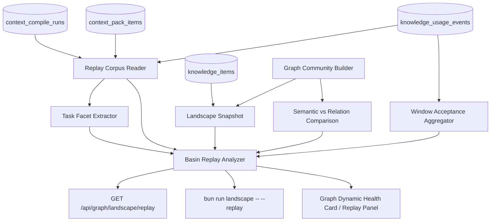

# Knowledge Landscape Attractor Phase 2A 実装計画

> Status: implementation plan
> Date: 2026-05-24 JST
> Based on: `docs/knowledge-landscape-attractor-implementation-plan.md`

## 1. 目的

Phase 1 で実装した `Landscape Snapshot` を、実タスク履歴と再現可能な比較へ接続する。

Phase 2A の目的は、Attractor / Negative Candidate / Dead Zone が「実際の task compile 挙動を説明できるか」を検証できる状態にすることである。ここではまだ production ranking、自動 `appliesTo` 修正、promotion gate 実行には接続しない。

対象は次の 4 領域に限定する。

1. Replay Corpus との接続
2. task facet ごとの basin analysis
3. window 化された agentic acceptance signal
4. semantic community と relation community の比較

## 2. 基本方針

### 2.1 Replay first を固定する

Phase 2A でも本番 `context_compile` の ranking は変更しない。

やること:

- 既存 `context_compile_runs` / `context_pack_items` / `knowledge_usage_events` を replay corpus として読み出す
- 過去 run がどの community / basin に落ちたかを再構成する
- landscape classification が run outcome を説明できているかを集計する
- CLI / API / UI で read-only に表示する

やらないこと:

- runtime ranking の変更
- compile 時の diversity boost
- `appliesTo` 自動更新
- candidate 自動 promotion / demotion
- replay 結果を knowledge score に直接反映

### 2.2 Replay は再実行ではなく replay annotation から始める

初期実装では、過去 run を再度 `context_compile` しない。

まず既存 DB に残っている以下を replay corpus として扱う。

- `context_compile_runs.input`
- `context_compile_runs.goal`
- `context_compile_runs.intent`
- `context_compile_runs.repo_path`
- `context_compile_runs.retrieval_mode`
- `context_compile_runs.status`
- `context_compile_runs.degraded_reasons`
- `context_pack_items`
- `knowledge_usage_events`

これに Phase 1 の landscape snapshot を重ねて、run ごとに次を注釈する。

```txt
compile run
  -> selected knowledge ids
  -> community keys
  -> landscape classifications
  -> task facets
  -> observed verdicts
  -> replay explanation score
```

本当の再コンパイル比較は Phase 2B 以降に分離する。

### 2.3 Task facet は existing input から復元する

新しい task taxonomy table は作らない。

初期 facet は、既存 `context_compile_runs.input` と `context_compile_runs` の列から復元できる範囲に限定する。

- `retrievalMode`
- `repoPath` / `repoKey`
- `technologies`
- `changeTypes`
- `domains`
- `source`
- `status`
- degraded reason bucket

欠損している facet は `unknown` として扱う。LLM による facet 推定は Phase 2A では行わない。

### 2.4 Agentic acceptance は window signal にする

`knowledge_items.agentic_accept_count` は累積 counter であり、Phase 1 の window score には混ぜなかった。

Phase 2A では、run 単位で agentic acceptance を後追い分析できるようにする。

初期方針:

- 既存 `knowledge_usage_events.actor = 'agent'` を window aggregation に含める
- 追加実装では、agentic refine が選んだ knowledge に `metadata.agenticAccepted = true` を保存する
- 既存 counter は引き続き all-time support signal として扱う
- score へ混ぜる前に、window acceptance の説明力を replay report で確認する

### 2.5 Semantic community comparison は read-time derived にする

Phase 1 の community は relation edge 由来である。

Phase 2A では、semantic edge 由来の community を read-time に導出し、relation community と比較する。永続 community id は作らない。

比較対象:

- relation community: `session/project/source` edge の連結成分
- semantic community: semantic edge の連結成分

比較結果:

- same / split / merge / orphaned
- Dead Zone が semantic community では到達可能に見えるか
- relation attractor と semantic cluster が一致しているか

## 3. Architecture



## 4. Data contract v1

### 4.1 Replay corpus unit

```ts
type LandscapeReplayRun = {
  runId: string;
  createdAt: string;
  goal: string;
  retrievalMode: string;
  status: "ok" | "degraded" | "failed";
  source: string;
  taskFacets: LandscapeTaskFacets;
  selectedKnowledgeIds: string[];
  selectedCommunityKeys: string[];
  verdicts: {
    used: number;
    notUsed: number;
    offTopic: number;
    wrong: number;
  };
  basinTrace: LandscapeBasinTrace[];
};
```

### 4.2 Task facets

```ts
type LandscapeTaskFacets = {
  repoKey?: string;
  repoPath?: string;
  retrievalMode: string;
  technologies: string[];
  changeTypes: string[];
  domains: string[];
  source: string;
  degradedReasonBuckets: string[];
};
```

### 4.3 Basin trace

```ts
type LandscapeBasinTrace = {
  communityKey: string;
  communityLabel: string;
  selectedItemCount: number;
  classificationAtReplay: LandscapeClassificationPrimary;
  verdictMix: {
    used: number;
    notUsed: number;
    offTopic: number;
    wrong: number;
  };
  explanation:
    | "aligned_attractor"
    | "negative_explained"
    | "dead_zone_missed"
    | "over_selected"
    | "unexplained";
};
```

### 4.4 Replay summary

```ts
type LandscapeReplaySnapshot = {
  generatedAt: string;
  windowDays: number;
  replayRunCount: number;
  facetSummaries: LandscapeFacetBasinSummary[];
  communityReplaySummaries: LandscapeCommunityReplaySummary[];
  acceptanceWindow: LandscapeAcceptanceWindowSummary;
  communityComparison: LandscapeCommunityComparisonSummary;
};
```

API schema は Phase 1 と同じく `src/shared/schemas/*` に zod schema を置く。

## 5. Milestone 1: Replay Corpus Reader

目的: 既存 compile run 履歴を landscape analysis に接続する。

作業:

- `src/modules/landscape/landscape-replay.types.ts` を追加
- `src/modules/landscape/landscape-replay.repository.ts` を追加
- `context_compile_runs` / `context_pack_items` / `knowledge_usage_events` を window で読み出す
- selected knowledge ids から Phase 1 community key へ join する
- `buildLandscapeReplaySnapshot` service を追加する
- API / CLI にはまだ出さず、unit test で domain model を固定する

重要な実装条件:

- `context_compile_runs.pack_snapshot` ではなく `context_pack_items` を primary source にする
- `pack_snapshot` は補助情報としてだけ使う
- replay corpus は run status が `ok/degraded/failed` の全てを対象にし、status 別に分ける
- selected item は `item_kind in ('rule', 'procedure')` のみ

完了条件:

- window 内 run count と selected knowledge count が再現できる
- run ごとに selected community keys を持てる
- feedback がない run も corpus から落とさない
- fixture test で `used/off_topic/wrong` の verdict mix が community 単位に集約される

## 6. Milestone 2: Task Facet Basin Analysis

目的: 「どの task facet がどの basin に落ちるか」を説明できるようにする。

作業:

- `src/modules/landscape/landscape-facets.ts` を追加
- `context_compile_runs.input` から `technologies/changeTypes/domains/repoPath/repoKey` を抽出
- `goal` 文字列からの推定は行わない
- facet group ごとに community classification と verdict mix を集計する
- `facetSummaries` を replay snapshot に追加する

初期 facet grouping:

- `retrievalMode`
- `repoKey`
- `technology`
- `changeType`
- `domain`
- `source`
- `degradedReasonBucket`

集計指標:

- replayRunCount
- selectedItemCount
- selectedCommunityCount
- attractorHitCount
- negativeCandidateHitCount
- deadZoneMissCount
- usedRate
- offTopicRate
- wrongRate
- feedbackCoverageRate

完了条件:

- `domain=graph-ui` のような facet で basin summary を出せる
- unknown facet が集計を壊さない
- 1 run が複数 facet に属する場合も、run-level と item-level count を混同しない
- CLI で top facet risks を表示できる準備がある

## 7. Milestone 3: Window Agentic Acceptance Signal

目的: 累積 `agentic_accept_count` ではなく、window 内の agentic acceptance を landscape / replay で説明できるようにする。

作業:

- `recordCompileRunKnowledgeUsageSignalsSafe` へ渡す metadata に `agenticAccepted` を追加する
- `selectedRankMap` と同様に `agenticAcceptedKnowledgeIds` 由来の set を usage signal へ渡す
- 既存 `knowledge_usage_events` に保存する。新規 table は作らない
- `landscape.repository.ts` に window acceptance aggregate を追加する
- `LandscapeCommunity.feedback` とは分けて `acceptance` セクションを追加する
- replay snapshot に `acceptanceWindow` を追加する

想定 metadata:

```json
{
  "agenticAccepted": true,
  "signalSource": "context_response_composer",
  "selectedRank": 3
}
```

スコアへの扱い:

- Phase 2A では AttractorScore に混ぜない
- `acceptanceRateWindow` と `acceptedRunCountWindow` を表示するだけにする
- replay で used verdict との相関を確認してから Phase 2B で score 接続を判断する

完了条件:

- 新しい run では `knowledge_usage_events.metadata.agenticAccepted` が保存される
- 既存 run は `unknown` として扱い、0 と断定しない
- window acceptance が community / facet 単位で集計できる
- all-time `agenticAcceptCount` と window acceptance が API response で混ざらない

## 8. Milestone 4: Semantic vs Relation Community Comparison

目的: relation community だけでは見えない retrieval 空間のズレを検出する。

作業:

- `buildGraphSnapshot({ view: "semantic" })` の semantic edges を community builder に通す read-only helper を追加
- relation community key と semantic community key を knowledge id 経由で比較する
- community comparison summary を landscape replay snapshot に追加する
- Dead Zone に対して、semantic community 側で selected neighbor があるかを見る

比較分類:

- `aligned`: relation community と semantic community がほぼ一致
- `semantic_split`: relation community が複数 semantic clusters に分かれる
- `semantic_merge`: 複数 relation communities が semantic cluster で合流する
- `relation_orphan`: relation community はあるが semantic edge が薄い
- `semantic_reachable_dead_zone`: Dead Zone だが semantic 近傍には使われている community がある

初期指標:

- jaccardOverlap
- relationCommunitySize
- semanticCommunitySize
- selectedNeighborCountWindow
- deadZoneSemanticReachabilityScore

完了条件:

- relation community と semantic community の対応表を生成できる
- Dead Zone のうち semantic 近傍から到達性改善候補を出せる
- Graph UI の既存 semantic / community view の response は壊さない
- 比較結果は read-only で、ranking には接続しない

## 9. Milestone 5: API / CLI / UI Integration

目的: 運用者が Phase 2A の結果を読める状態にする。

### 9.1 API

追加候補:

```txt
GET /api/graph/landscape/replay
```

Query:

| parameter | default | note |
| --- | --- | --- |
| `windowDays` | `30` | `1..180` |
| `limit` | `500` | replay run limit |
| `status` | `all` | compile run status |
| `relationAxes` | `session,project,source` | Phase 1 basis |
| `facet` | optional | future filter |
| `format` | `full` | summary は後続 |

### 9.2 CLI

既存 script に option を追加する。

```bash
bun run landscape -- --replay --window-days 30
bun run landscape -- --replay --window-days 30 --json
bun run landscape -- --compare-communities --window-days 30
```

表示例:

```txt
Landscape Replay (30d)
Runs: 184
Feedback coverage: 41%
Aligned attractor runs: 72
Negative explained runs: 5
Dead-zone missed runs: 18

Top facet risks:
- domain:graph-ui off_topic=23% dead_zone_missed=8
- changeType:refactor over_selected=12
```

### 9.3 UI

Graph Community View の右 panel を拡張する。

追加表示:

- Replay Health
- top task facets
- replay run count
- acceptance window
- semantic/relation comparison badge

UI 方針:

- Phase 1 の Dynamic Health Card を主にする
- Replay は折りたたみ可能な read-only セクション
- 実行ボタンや修正ボタンは置かない

## 10. Test Plan

Unit tests:

- facet extraction
- replay run aggregation
- basin trace classification
- acceptance metadata aggregation
- semantic/relation overlap classification

Route tests:

- `/api/graph/landscape/replay` default query
- custom window/status/limit
- schema parse

Component tests:

- Replay section is shown only in community view
- no replay fetch outside community view
- missing replay data renders neutral empty state
- semantic comparison badge appears for selected community

Live calibration:

- `bun run doctor`
- `bun run landscape -- --window-days 30`
- `bun run landscape -- --replay --window-days 30`
- `bun run landscape -- --compare-communities --window-days 30`
- representative run detail を 3-5 件手動確認

Quality gates:

- targeted vitest
- `bun run build:web`
- `bun run typecheck`
- `bun run lint`
- `bun run format:check`

既存並行タスクで全体ゲートが落ちる場合は、Landscape 対象ファイルの targeted lint / format / tests を必ず記録する。

## 11. File-level implementation map

| file | change |
| --- | --- |
| `src/modules/landscape/landscape-replay.types.ts` | replay snapshot types |
| `src/modules/landscape/landscape-replay.repository.ts` | compile run / pack item / usage event reader |
| `src/modules/landscape/landscape-replay.service.ts` | replay corpus + landscape snapshot integration |
| `src/modules/landscape/landscape-facets.ts` | task facet extraction |
| `src/modules/landscape/landscape-community-comparison.ts` | semantic vs relation comparison |
| `src/shared/schemas/landscape-replay.schema.ts` | API schema |
| `api/modules/graph/graph.routes.ts` | `/landscape/replay` route |
| `src/cli/landscape.ts` | `--replay` / `--compare-communities` |
| `web/src/modules/admin/repositories/admin.repository.ts` | replay fetcher and types |
| `web/src/modules/admin/components/graph.page.tsx` | Replay Health section |
| `test/landscape-replay.test.ts` | replay service tests |
| `test/landscape-facets.test.ts` | facet extraction tests |
| `test/landscape-community-comparison.test.ts` | comparison tests |
| `test/graph.routes.test.ts` | replay route contract |
| `test/components/admin/graph-page.test.tsx` | UI replay panel tests |

## 12. Risk controls

### 12.1 Replay corpus bias

Risk: 過去 run が現在の corpus と一致しない。

Control:

- replay snapshot に `generatedAt` と `corpusWindow` を含める
- run created time と current landscape time を分ける
- deleted / missing knowledge ids を `missingKnowledgeCount` として出す

### 12.2 Feedback sparsity

Risk: feedback が少ない facet を強く断定してしまう。

Control:

- `feedbackCoverageRate` を必須表示
- `feedbackCount < minFeedbackCount` は `insufficient` とする
- Negative は引き続き candidate 表示

### 12.3 Agentic acceptance ambiguity

Risk: `agenticAccepted` がない既存 run を非 acceptance と誤解する。

Control:

- `acceptedCountWindow` と `unknownAcceptanceCountWindow` を分ける
- metadata 導入前の run は unknown
- all-time counter と window event は別 field

### 12.4 Semantic over-merge

Risk: semantic edge が大きな cluster を作りすぎる。

Control:

- `minSimilarity` / `semanticTopK` を response thresholds に返す
- semantic comparison は recommendation ではなく diagnostic
- relation community を primary basis のまま維持

## 13. 受け入れ基準

Phase 2A 完了条件:

1. Replay Corpus が既存 compile run から read-only に構築できる
2. run ごとに selected community / verdict mix / basin trace を持てる
3. task facet ごとの basin summary が出せる
4. window agentic acceptance が all-time counter と分離されている
5. semantic community と relation community の比較が read-time に生成できる
6. Dead Zone の semantic reachability candidate が説明可能である
7. API / CLI / UI が同じ replay service を使う
8. ranking / promotion / auto-refine への副作用がない
9. fixture tests が replay / facet / acceptance / comparison を固定している
10. live DB で代表 run を手動確認できる

## 14. Phase 2B 以降に回すもの

- replay による actual recompile
- ranking experiment sandbox
- `appliesTo` refine candidate 生成
- promotion gate summary
- replay diff を使った score tuning
- exploration / diversity boost の実 compile 投入
- `memory-router landscape` dispatcher

Phase 2B へ進む条件は、Phase 2A の replay report が「どの basin 分類が何を説明しているか」を実データで示せることとする。
