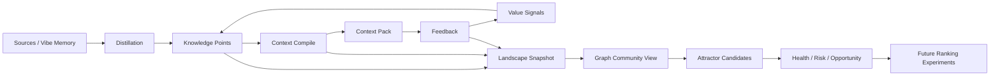

# Knowledge Landscape コンセプトデザイン

> Status: discussion draft
> Scope: 実装計画の前段。ここでは概念、境界、優先対象を定義し、具体的なテーブル追加・API・CLI 手順はまだ決めない。
> Date: 2026-05-22

## 1. 目的

memory-router はすでに、会話ログ、Wiki、ドキュメントから reusable な `rule` / `procedure` を蒸留し、`context_compile` でタスクに合わせて選出する。

この文書の目的は、その既存システムを次の方向へ拡張するためのたたき台を作ることである。

```txt
knowledge = saved text
```

ではなく、

```txt
knowledge = task state を特定の判断・手順へ収束させる地形
```

として扱う。

ただし、ここでの「知識場」は、最初から新しい neural architecture を作るという意味ではない。初期段階では、既存 DB に保存されている knowledge、embedding、compile run、feedback、source links から導出される read-only な分析レイヤーとして扱う。

## 2. 出発点

現在の memory-router には、Knowledge Landscape の前段階と見なせる要素がすでにある。

- `knowledge_items`
  - `title`, `body`, `type`, `status`, `scope`
  - `embedding`
  - `importance`, `confidence`, `dynamicScore`
  - `appliesTo`
- `context_compile_runs`
  - task goal, intent/retrieval mode, selected items, status, degraded reasons
- `context_pack_items`
  - compile run ごとの選出 knowledge
- `knowledge_usage_events`
  - `used`, `off_topic`, `wrong`
- `knowledge_review_queue`
  - `wrong` 起点の人間レビュー
- `knowledge_quality_adjustments`
  - 継続的な `off_topic` による品質減点履歴
- graph/admin surfaces
  - semantic edge、source edge、project/session edge の可視化の入口

このため、最初にやるべきことは schema を大きく増やすことではない。既存の点群、履歴、feedback を「地形」として読み替え、観測することである。

## 3. 外部研究から借りる概念

この章は research note であり、実装対象ではない。

### 3.1 Transformer

Transformer は recurrence / convolution を使わず attention を中心に sequence transduction を行う architecture として提案された。memory-router の観点では、Transformer は context 内の関連を強力に処理するが、外部に蓄積された経験をどう構造化し、どう更新し、どう再利用するかは別問題として残る。

参考: [Attention Is All You Need](https://arxiv.org/abs/1706.03762)

### 3.2 RAG

RAG は parametric memory と non-parametric memory を組み合わせる方向を示した。特に、知識更新と provenance の問題をモデル内パラメータだけで解決しない点が memory-router と近い。

ただし、通常の RAG は retrieved passage を渡すことが中心であり、経験から rule/procedure を蒸留し、feedback によって地形を変形するところまでは扱わない。

参考: [Retrieval-Augmented Generation for Knowledge-Intensive NLP Tasks](https://arxiv.org/abs/2005.11401)

### 3.3 Energy-Based Models

Energy-Based Models は、変数の configuration に scalar energy を与え、低 energy の状態へ推論を寄せる枠組みとして理解できる。Knowledge Landscape では、この考え方を厳密な EBM としてではなく、「ある task state に対して選ばれやすい knowledge cluster が低 energy basin として見える」という分析メタファーとして使う。

参考: [A Tutorial on Energy-Based Learning](https://yann.lecun.org/exdb/publis/pdf/lecun-06.pdf)

### 3.4 Hopfield Networks / Attractor

Modern Hopfield Network は continuous state、energy minima、associative memory、attention との関係を示している。ここから借りるべき概念は、knowledge を単なる保存済み item ではなく「状態を収束させる attractor」として見る視点である。

memory-router での初期定義は、数学的な Hopfield layer ではなく次で十分である。

```txt
Attractor = 似た task state で繰り返し選出され、feedback 上も有効だった knowledge cluster
```

参考: [Hopfield Networks is All You Need](https://arxiv.org/abs/2008.02217)

### 3.5 Neural Fields

Neural Fields は、座標を入力として空間・時間上の性質を連続関数として表現する。Knowledge Landscape では、knowledge item を孤立点としてだけでなく、embedding 空間上の連続的な評価関数として扱う発想に近い。

ただし、memory-router の初期段階では neural field model を学習しない。まずは DB 上の近傍、履歴、feedback から「field-like view」を作る。

参考: [Neural Fields in Visual Computing and Beyond](https://arxiv.org/abs/2111.11426)

### 3.6 Geometric Deep Learning

Geometric Deep Learning は、対象データの低次元構造や対称性、domain structure を利用する考え方を整理している。memory-router では、単なる text similarity ではなく、repo path、technology、change type、domain、source lineage などの構造を、embedding 空間とは別の幾何制約として扱える。

参考: [Geometric Deep Learning: Grids, Groups, Graphs, Geodesics, and Gauges](https://arxiv.org/abs/2104.13478)

### 3.7 Memory OS / Experience Replay

MemGPT は LLM の limited context window を OS 的な memory tier management で拡張する方向を示した。Experience Replay は continual learning における forgetting 対策として、過去経験の再利用を扱う。

memory-router に引き寄せるなら、必要なのは単に memory tier を増やすことではなく、compile run と feedback を replay 可能な評価 corpus にすることである。

参考:

- [MemGPT: Towards LLMs as Operating Systems](https://arxiv.org/abs/2310.08560)
- [Experience Replay for Continual Learning](https://arxiv.org/abs/1811.11682)

## 4. 中心コンセプト

### 4.1 Knowledge Point

`knowledge_items` の 1 行。

既存の `title`, `body`, `embedding`, `importance`, `confidence`, `dynamicScore`, `appliesTo`, `sourceRefs` を持つ。

Knowledge Landscape では、これは「知識そのもの」ではなく、地形を構成する観測点として扱う。

### 4.2 Task State

`context_compile` に渡された goal、retrieval mode、repo path、technologies、change types、domains、必要なら query embedding から構成される状態。

初期段階では新しい永続モデルにしない。`context_compile_runs.input` と既存 diagnostics から復元できる範囲で扱う。

### 4.3 Attractor

近い task state 群から、繰り返し同じ knowledge cluster へ収束している場合、その cluster を attractor と呼ぶ。

Attractor の初期指標:

- 近傍 task count
- selected count
- agentic accepted count
- `used` rate
- `off_topic` rate
- `wrong` count
- 平均 `dynamicScore`
- source evidence density
- freshness / decay

### 4.4 Basin

ある attractor に収束しやすい task state の領域。

初期段階では厳密な連続領域ではなく、次の集合として扱う。

```txt
同じ retrieval mode / changeTypes / technologies / repo scope で、
類似 query から同じ cluster が選ばれた compile run 群
```

### 4.5 Field Deformation

feedback や検証履歴によって、同じ task state でも選ばれる knowledge が変わること。

既存の `dynamicScore`、`knowledge_quality_adjustments`、`lastVerifiedAt`、`status` が初期の deformation source になる。

### 4.6 Repulsion

ある knowledge が「選ばれてはいけない方向」へ地形を押し返す力。

初期段階では次で表現できる。

- `off_topic` の継続
- `wrong` review queue
- deprecated status
- stale decay
- source evidence 不足
- vector-only low confidence suppression

### 4.7 Non-use / Reachability

`context_compile` で全く使われない knowledge は、単純に低品質とは限らない。

未使用 knowledge は少なくとも次の 3 種類に分ける。

```txt
1. 本当に不要
   低品質、重複、古い、source が薄い

2. 使えるが到達できていない
   appliesTo が悪い、embedding が弱い、title/body が検索に引っかからない

3. まだ該当タスクが来ていない
   niche だが将来必要
```

したがって、non-use は `importance` / `confidence` を直接下げる信号ではなく、まずは reachability と運用優先度の signal として扱う。

```txt
qualityScore
= 内容そのものの信頼性

utilityScore
= 実際に使われているか

reachabilityScore
= 使われるべきなのに到達できているか

riskScore
= wrong / off_topic / stale / duplicate / conflict
```

未使用の active knowledge が多い community は `dead zone` として観測する。ただし dead zone は削除候補ではなく、まず「不要なのか、到達できていないのか」を切り分ける対象である。

### 4.8 Trajectory

task state から最終 context pack までの経路。

```txt
query / facets
-> text hits
-> vector hits
-> merged candidates
-> rankAndDedupe
-> evidence filter
-> agentic refine
-> selected pack items
-> feedback
```

現在も部分的には run snapshot と diagnostics で追えるが、全 candidate の中間状態は十分には保存されていない。これは将来の観測対象であり、初期実装では read-only snapshot に含めすぎない。

### 4.9 Cluster / Community / Attractor

Graph と Knowledge Landscape を接続する場合、`cluster`、`community`、`attractor` は分けて扱う。

```txt
cluster
= embedding / lexical similarity 上の近さ

community
= graph edge 上のまとまり

attractor
= compile / feedback 履歴上、task state が繰り返し収束しているまとまり
```

この区別は重要である。

`cluster` は意味的に近い knowledge の点群であり、まだ挙動を含まない。`community` は semantic edge、source edge、session edge、project edge のような graph relation から見える構造であり、必ずしも embedding だけでは決まらない。`attractor` は構造ではなく挙動であり、タスクがそこへ吸い寄せられ、結果として有効だったことが compile / feedback 履歴から観測できる場合にだけ呼ぶ。

したがって、Graph UI で最初に見るべきものは attractor そのものではなく、community である。community を見たうえで、selected count、feedback、source evidence、staleness を重ねると、attractor candidate か negative attractor candidate かを判断しやすくなる。

## 5. 推奨してやるべきもの

### 5.1 Tier 1: まず観測する

#### 1. Knowledge Landscape Snapshot

既存データだけで、knowledge space の状態を読める snapshot を作る。

出したいもの:

- knowledge count by status/type
- embedded ratio
- semantic clusters
- cluster ごとの selected / used / off_topic / wrong
- cluster ごとの average importance / confidence / dynamicScore
- source evidence density
- stale / deprecated ratio
- zero-use active ratio
- reachability risk

これは実装計画に進める価値が高い。schema 追加なしで始められ、失敗しても ranking へ悪影響を出さない。

#### 2. Attractor Candidate Report

「この cluster は attractor らしい」と言える候補を抽出する。

初期条件:

- cluster 内 knowledge が複数回 compile に出ている
- feedback が `used` 寄り
- `off_topic` と `wrong` が低い
- source evidence がある
- appliesTo が task facet と整合する

反対に、次は negative attractor として扱う。

- よく選ばれるが `off_topic` が高い
- よく選ばれるが `wrong` queue がある
- semantic cluster 内に contradictory な rule/procedure が混在している
- draft が多いが active 化されていない

#### 3. Graph Community View

既存 Graph に community の見え方を足す。

初期の目的は、1000-2000 件規模の knowledge corpus を item 単位で眺めることではなく、どの領域に知識が集まっているかを見ることである。

最初に試す視覚表現:

- node color: community
- node size: selected count または `dynamicScore`
- node border: `draft` / `active` / `deprecated`
- node halo: attractor strength candidate
- red outline: `off_topic` / `wrong` risk
- edge thickness: similarity / source relation / co-selected strength
- opacity: source evidence density または staleness

この段階では community assignment は derived data とし、canonical knowledge を変更しない。

#### 4. Task-to-Knowledge Trajectory の最小記録

今すぐ全候補を保存する必要はないが、将来的には `context_compile` の候補選別過程を観測できるようにしたい。

最初は、run detail に次を出すだけでよい。

- text hits count
- vector hits count
- merged count
- suppressed count
- agentic refined count
- selected count
- final selected knowledge ids

#### 5. Ranking にはまだ入れない

Tier 1 では ranking を変えない。

理由:

- attractor 指標の正しさが未検証
- feedback が少ない段階では偏りが強い
- `dynamicScore` との二重加点になりやすい
- compile が不安定になった時に原因追跡が難しくなる

### 5.2 Tier 2: 地形の品質を見る

#### 6. Attractor Health

Attractor ごとに health を出す。

例:

- Strong useful attractor
- Over-selected but off-topic
- Evidence-thin attractor
- Stale attractor
- Contradictory cluster
- Underused high-value cluster

これは Doctor / Overview / Graph UI のどこかに載せられる可能性がある。ただし、UI 実装はこの文書の範囲外。

#### 7. Community Supernode View

Graph が大きくなると、knowledge node をそのまま表示しても読めなくなる。1000-2000 件規模では、個別ノード表示より先に community を 1 ノードへ圧縮した view が必要になる。

Community supernode に表示する値:

- knowledge count
- rule / procedure ratio
- active / draft / deprecated ratio
- selected count
- `used` / `off_topic` / `wrong` rate
- source evidence density
- average `dynamicScore`
- stale ratio
- representative knowledge

この view は「知識の大陸」を見るためのものと位置づける。個別 knowledge の詳細確認は、supernode から drill-down する。

#### 8. Risk / Health Overlay

Graph 上に地形の health を重ねる。

例:

- strong useful attractor: 明るい halo
- negative attractor: 赤い outline
- dead zone: node は多いが compile で使われない community
- thin evidence zone: よく使われるが source evidence が薄い community
- procedure gap: rule に偏り、procedure が少ない community
- stale zone: `lastVerifiedAt` や decay が弱い community

これは単なる network visualization ではなく、knowledge corpus の運用リスクを見つけるための view である。

#### 9. Dead Zone / Reachability Review

compile で使われない knowledge や community を `dead zone` として抽出する。

ただし、dead zone は削除対象ではない。最初に見るべき問いは次である。

- 本当に不要な knowledge か
- source evidence はあるのに retrieval が届いていないのか
- `appliesTo` が広すぎる、狭すぎる、または空なのか
- title/body が検索 query と噛み合っていないのか
- embedding が生成されていない、または古い provider 由来なのか
- 類似 community には需要があるのか
- procedure として使うべき内容が rule に偏っていないか

Dead zone の判断:

- source evidence が薄く、duplicate / stale / deprecated も強い場合は cleanup candidate
- source evidence があり、importance / confidence が高い場合は reachability repair candidate
- 類似 community がよく使われている場合は appliesTo / title / body / edge 補正 candidate
- niche で該当タスクが来ていないだけの場合は保留

この signal は `importance` / `confidence` の自動減点ではなく、review priority、promotion gate、reachability repair に使う。

#### 10. Knowledge Merge / Split Suggestion

semantic cluster を見て、人間レビュー向けに提案を出す。

- merge candidate
  - 内容がほぼ同じ rule/procedure が複数ある
- split candidate
  - 1 つの body が複数の applicability を混ぜている
- conflict candidate
  - 近傍に逆向きの指示がある

初期段階では自動変更しない。review queue か candidate list に出すだけにする。

#### 11. Compile Trajectory Playback

ある `context_compile` run を選び、Graph 上で task state から context pack までの経路を再生する。

再生したい流れ:

```txt
query / task state
-> candidate nodes light up
-> ranking で残った nodes を強調
-> agentic refine 後に残った nodes をさらに強調
-> final context pack nodes を固定表示
-> feedback 結果で色を変える
```

これにより、次を視覚的に確認できる。

- task がどの community に吸い寄せられたか
- 本来行くべき community に行ったか
- 変な community に吸われたか
- source evidence の薄い community が選ばれていないか
- negative attractor が再選出されていないか

Trajectory playback は ranking 変更前の検証に使えるため、Replay Corpus と相性がよい。

#### 12. Replay Corpus

過去の compile run を replay し、ranking の変更が context pack にどう影響するかを見る。

必要な問い:

- 以前 `used` だった knowledge は引き続き選ばれるか
- `off_topic` とされた knowledge は下がるか
- `wrong` queue 中の knowledge が再選出されていないか
- degraded reasons が増えていないか

これは ranking 変更の前提になる。

### 5.3 Tier 3: 地形を利用する

#### 13. Exploration / Diversity Boost

Attractor が強くなると、既存の有効 knowledge に早く収束できる一方で、未使用だが有用な knowledge を発見しにくくなる。

そのため、ranking に入る前の実験段階では exploitation と exploration を分けて考える。

```txt
exploitation
= 既知の強い attractor を使う

exploration
= 近いが未使用の high-quality knowledge を少量混ぜて feedback を得る
```

Exploration candidate の条件:

- source evidence がある
- duplicate / near_duplicate ではない
- importance / confidence が高い
- semantic neighbor または community に需要がある
- compile で未使用または低使用
- `off_topic` / `wrong` の履歴がない

Exploration は token budget を大きく使ってはいけない。初期案では、最終 context pack ではなく candidate observation / replay で試し、実運用に入れる場合も小さな枠に限定する。

#### 14. Cluster-aware Ranking

Attractor 指標を ranking に弱く反映する。

初期案:

- cluster health が高い場合だけ小さく boost
- negative attractor は boost ではなく warning / suppression candidate として扱う
- `wrong` は自動減点ではなく review-required signal のまま維持する
- dead zone は直接 penalty ではなく、reachability repair または promotion gate の signal として扱う

#### 15. Basin-aware Query Expansion

task state が既知 basin に近い場合、その basin で過去に効いた facet や query hint を使って retrieval を補助する。

ただし、これは `context_compile` の挙動を変えるため、replay corpus と observability が整ってから扱う。

#### 16. Sandbox Comparison View

将来、attractor weight、cluster merge/split、ranking boost などを sandbox で試す場合、Graph は baseline と sandbox の差分を見る操作盤になる。

見たい差分:

- 強くなった community
- 弱くなった community
- 沈んだ node
- 新しく接続された edge
- 変わった compile trajectory
- 改善した feedback projection
- 悪化した off-topic projection

これは canonical corpus を直接変更する UI ではない。baseline snapshot と mutable sandbox を比較し、良い変更だけを candidate / review / quality adjustment 経由で戻すための検証 view である。

#### 17. Automatic Candidate Generation

Attractor / negative attractor / conflict cluster から、新しい `knowledge_candidate` を作る。

例:

- 何度も `off_topic` になった rule をより狭い appliesTo に分解する candidate
- 似た procedure を統合する candidate
- missing procedure を提案する candidate
- source evidence はあるが未使用の knowledge を reachability repair candidate にする
- 類似 community が dead zone 化している場合に、新規 candidate promotion を抑制する

これは強力だが、初期対象ではない。既存の staged distillation と candidate pipeline に載せる形に限定する。

## 6. やらないこと

### 6.1 自然言語 body を捨てない

embedding や cluster だけでは、レビュー、監査、修正、source grounding ができない。

自然言語は知能の本質ではないかもしれないが、現在の product surface では人間と agent が共有する監査可能な interface である。

### 6.2 `knowledge_items` を neural field に置き換えない

今の価値は、蒸留済み rule/procedure と source evidence が明確に追跡できることにある。連続関数モデルを primary store にすると、この強みを失う。

### 6.3 大きな schema を先に作らない

Attractor、Basin、Field という名前の primary table をすぐ作らない。

まずは derived view / CLI report / API response として扱い、安定した指標だけを後から永続化する。

### 6.4 AGI architecture をこの repo で直接作らない

この repo の実用領域は、coding agent の context engineering と reusable knowledge management である。

目標は AGI そのものではなく、agent が経験からより良い context に収束するためのローカルファーストな知識地形を作ることである。

### 6.5 feedback を過信しない

`used`, `off_topic`, `wrong` は強い signal だが、初期データ量では bias が大きい。

- `used` は「本当に役立った」とは限らない
- `off_topic` は task phrasing に依存する
- `wrong` は正誤確認が必要
- no feedback は negative signal ではない

このため、自動反映は既存方針どおり慎重に扱う。

### 6.6 non-use を品質低下として自動反映しない

compile で使われないことは重要な signal だが、単独では negative feedback ではない。

やらないこと:

- 未使用だから `importance` / `confidence` を自動で下げる
- 未使用だから candidate promotion を一律に止める
- 未使用だから active knowledge を自動 deprecated にする
- 未使用 community を削除候補としてだけ扱う

やるべきこと:

- unused / zero-use を reachability signal として見る
- source evidence と組み合わせて cleanup か repair かを分ける
- Graph 上で dead zone として可視化する
- replay と exploration で、使えるのに埋もれた knowledge を探す

## 7. Conceptual Architecture



重要なのは、`Landscape Snapshot` が初期段階では read-only であること。

```txt
observe first
then explain
then replay
then rank
```

の順に進める。

## 8. 用語の初期定義

| Term | 初期定義 | 永続化 |
|---|---|---|
| Knowledge Point | `knowledge_items` の 1 行 | 既存 |
| Task State | compile input + retrieval mode + facets | 既存から復元 |
| Trajectory | compile の候補選別経路 | 一部既存、将来拡張 |
| Cluster | embedding / lexical similarity 上の近傍点群 | 初期は derived |
| Community | semantic / source / session / project edge 上のまとまり | 初期は derived |
| Attractor | 有効 feedback を伴って繰り返し選ばれる semantic cluster | 初期は derived |
| Negative Attractor | よく選ばれるが off-topic / wrong が多い cluster | 初期は derived |
| Basin | 同じ attractor に収束しやすい task state 集合 | 初期は derived |
| Field Deformation | feedback / decay / quality adjustment による選出傾向の変化 | 一部既存 |
| Repulsion | 選出抑制・review-required を示す signal | 一部既存 |
| Non-use | compile で使われていない状態 | 一部既存 |
| Reachability | 使われるべき knowledge に retrieval が届く度合い | 初期は derived |
| Dead Zone | node/community は存在するが compile trajectory が通らない領域 | 初期は derived |
| Exploration | 未使用 high-quality knowledge を少量試すための枠 | 将来 |
| Supernode | community を 1 ノードへ圧縮した表示単位 | 派生 view |
| Trajectory Playback | compile run の候補選別経路を Graph 上で再生する view | 派生 view |

## 9. Research が足りない点

この文書を実装計画に進める前に、必要なら次を追加調査する。

### 9.1 Cluster 構築手法

候補:

- pgvector similarity graph + connected components
- HDBSCAN / UMAP 系の offline analysis
- Louvain / Leiden community detection
- source/repo/facet edge を混ぜた heterogeneous graph clustering

初期実装では DB 内 similarity edge だけで足りる可能性が高い。

### 9.2 Attractor 指標の妥当性

`selectedCount`, `usedRate`, `dynamicScore`, `sourceDensity` の重みは未確定。

最初は score を 1 つに潰さず、個別 signal を表示する方がよい。

### 9.3 Non-use 指標の妥当性

未使用 knowledge をどう扱うかは追加検証が必要である。

調べるべきこと:

- zero-use active knowledge のうち source evidence がある割合
- zero-use active knowledge の `appliesTo` 空欄率
- zero-use active knowledge の embedding 欠損率
- zero-use active knowledge が属する community の利用状況
- 高 importance / confidence なのに未使用の knowledge がどれだけあるか
- 未使用 knowledge を exploration で入れた時に `used` / `off_topic` がどう変わるか

この調査なしに non-use penalty を ranking に入れるべきではない。

### 9.4 Contradiction Detection

semantic near だけでは contradiction は検出できない。

初期候補:

- 同じ cluster 内で `must` / `avoid` が逆向き
- `appliesTo` が同じで body が衝突
- LLM review による conflict label

ただし regex ベースの過剰検出は避ける。人間レビュー向けの候補提示に留める。

### 9.5 Query/Task Embedding の保存方針

compile run ごとの query embedding を保存するかは未決定。

保存する利点:

- basin analysis がやりやすい
- replay / drift detection がやりやすい

懸念:

- DB サイズ
- embedding provider 変更時の互換性
- personal / sensitive task text の扱い

初期は goal text と existing diagnostics で始め、必要になったら保存を検討する。

### 9.6 UI Placement

候補:

- Graph view
- Overview
- Doctor
- 新しい Landscape view

概念上は Graph に近い。特に community coloring、supernode、trajectory playback は Graph の責務に置くのが自然である。

一方で、Overview は KPI / corpus summary、Doctor は runtime / automation / diagnostics を扱う方がよい。したがって、Landscape の視覚表現は Graph を中心にし、Overview / Doctor には summary signal だけを渡す構成が候補になる。

## 10. 実装計画へ進める条件

次の問いに答えられれば、実装計画に進める。

1. 初期 snapshot は CLI か API か UI か
2. cluster はどの単位で作るか
3. feedback が少ない knowledge をどう扱うか
4. `wrong` queue 中の knowledge を snapshot 上どう見せるか
5. source evidence density をどう定義するか
6. ranking 変更を含めるか、完全に read-only にするか
7. replay corpus を同時に作るか、後続に回すか
8. Graph community は embedding similarity だけで作るか、source/session/project edge も混ぜるか
9. community supernode を最初から出すか、node coloring から始めるか
10. compile trajectory playback を replay corpus と同時に扱うか
11. non-use を cleanup candidate、reachability repair candidate、保留のどれに分類するか
12. candidate promotion gate に dead zone signal を使う場合、どの条件で抑制するか
13. exploration / diversity boost を replay 限定にするか、実 compile に小さく入れるか

推奨回答は次である。

```txt
最初の実装計画では read-only CLI/API snapshot まで。
Graph は community coloring の設計まで。
non-use は metric と分類まで。
ranking 変更、query embedding 永続化、supernode UI、自動 candidate 生成、exploration 実投入は後続。
```

## 11. 推奨される最初の到達点

最初の到達点は次の 1 文で表せる。

```txt
memory-router doctor/overview とは独立に、
現在の knowledge corpus がどのような semantic cluster と feedback 地形を持つかを
read-only に観測できる。
```

期待する出力例:

```json
{
  "clusters": [
    {
      "id": "cluster:auth-validation-001",
      "label": "input validation / auth boundary",
      "knowledgeCount": 8,
      "selectedCount30d": 24,
      "usedCount30d": 11,
      "offTopicCount30d": 1,
      "wrongCount30d": 0,
      "zeroUseActiveRatio": 0.25,
      "avgDynamicScore": 42.5,
      "sourceEvidenceDensity": 0.75,
      "reachabilityRisk": "low",
      "health": "strong_useful_attractor",
      "representativeKnowledgeIds": ["..."]
    }
  ],
  "risks": [
    {
      "kind": "over_selected_off_topic",
      "clusterId": "cluster:legacy-runtime-002",
      "reason": "selected often but recent off_topic rate is high"
    },
    {
      "kind": "dead_zone_reachability_unknown",
      "clusterId": "cluster:unused-procedure-003",
      "reason": "source-backed knowledge exists but compile trajectories do not enter this community"
    }
  ]
}
```

この出力が得られると、次の議論が具体化できる。

- どの cluster が本当に agent の探索空間を狭めているか
- どの knowledge が過剰に選ばれているか
- どの領域に procedure が足りないか
- どの失敗経験が attractor になっているか
- どの未使用 knowledge が不要で、どれが到達性の問題なのか
- ranking を変える前に、過去 run で何を replay すべきか

## 12. まとめ

Knowledge Landscape は、Transformer 以後の AGI 像を直接実装する試みではない。

memory-router における現実的な意味は次である。

```txt
蒸留済み knowledge の点群
+ compile run の軌道
+ feedback による変形
+ source evidence の拘束
= coding agent のための観測可能な知識地形
```

最初に作るべきものは「地形そのもの」ではなく「地形を観測する計器」である。
