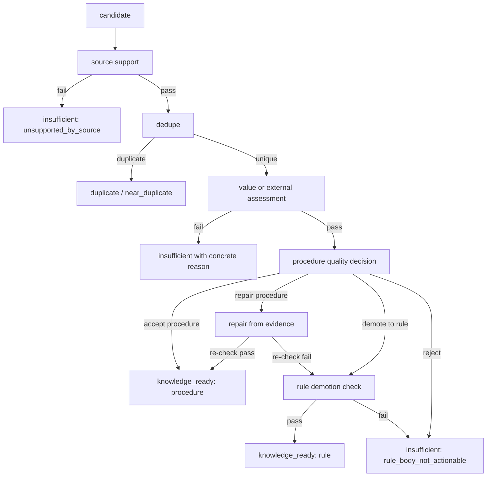

# Procedure Repair / Rule Demotion 実装計画

> Status: implementation plan
> Date: 2026-05-24
> Scope: `coverEvidence` / `finalizeDistille` / distillation pipeline の procedure 品質判定、rule 退避、procedure 修復、既存 insufficient 結果の再処理。

## 1. 目的

`procedure_body_not_actionable` を理由に重要そうな candidate が即 reject される問題を、品質ゲートを弱めずに解消する。

狙いは次の 4 点。

1. 明示的に `type = rule` として登録された candidate は、procedure 品質ゲートで落とさず rule として評価する
2. `procedure` として価値があるが本文構造だけが不足している candidate は、source evidence に基づいて skill-like procedure へ修復する
3. procedure には不足するが、再利用可能な制約・判断原則として成立する candidate は rule へ退避する
4. どちらにも足りない candidate は、具体的な理由つきで `insufficient` にする

この計画は reject を減らすこと自体を目的にしない。保存される knowledge の品質を維持しながら、procedure / rule の振り分けを正しくすることを目的にする。

## 2. 現状整理

現在の distillation はおおむね次の流れで candidate を扱っている。

1. `find_candidate_results` から候補を読む
2. `coverEvidence` で source support、重複、外部根拠、価値判定を通す
3. `cover_evidence_results.status = knowledge_ready` になったものを `finalizeDistille` が `knowledge_items` へ保存する
4. pipeline runner 側にも、invalid procedure を保存させない safety check がある

問題になっている地点は procedure 品質判定。

- `src/modules/distillation/procedure-quality.ts`
  - `hasSkillLikeProcedureBody` が `Use when:`, `Workflow:`, `Verification:`, `Avoid:` と workflow step を要求する
  - `shouldDemoteProcedureToRule` は現状かなり限定的で、procedure でない候補を rule として救う導線が弱い
- `src/modules/coverEvidence/helpers.ts`
  - `normalizeProcedureBodyQuality` が non-skill procedure を `insufficient` に落とす
- `src/modules/finalizeDistille/domain.ts`
  - 保存直前にも invalid procedure を reject する
- `src/modules/distillationPipeline/runner.ts`
  - pipeline 取り込み時にも invalid procedure を reject する

実DBでは `procedure_body_not_actionable` が `insufficient` の主要因になっている。特に、`origin.candidateType = rule` の candidate が古い worker や既存キャッシュにより procedure 品質ゲートで落ちた行がある。

また、`cover_evidence_results` は既存結果を再利用する。`insufficient` は retryable 扱いではないため、実装修正後も force refresh しない限り古い reject 結果が残る。

## 3. 方針

### 3.1 procedure 品質ゲートは弱めない

`procedure` として保存する条件は維持する。

procedure は、最低限次の構造を持つ必要がある。

- `Use when:`
- `Workflow:`
- `Verification:`
- `Avoid:`
- 実行可能な workflow step

この条件を満たさないものを procedure として保存しない。

### 3.2 reject の前に分類する

non-skill procedure を見つけたら、即 `insufficient` にせず、次の順で扱う。

1. original type が明示 `rule` なら、rule として再評価する
2. original type が明示 `procedure` なら、procedure 修復を試みる
3. inferred type の場合は、workflow signal と rule signal の強さで修復か demotion を選ぶ
4. どちらにも成立しない場合だけ `insufficient` にする

### 3.3 rule 退避にも品質ゲートを置く

rule へ退避する場合も、妥当性のない rule は保存しない。

rule として保存できる条件は次の通り。

- source support を通っている
- one-off の作業メモではなく、今後も使える制約・判断原則である
- 本文に具体的な禁止、優先、境界、確認条件、例外条件のいずれかがある
- evidence と矛盾しない
- 既存 knowledge と near duplicate ではない

### 3.4 procedure 修復は evidence-bound にする

procedure 修復は LLM に任せるが、source evidence に含まれる内容だけを使う。

修復 prompt では次を明示する。

- source evidence にないコマンド、ファイル、仕様を作らない
- 不明な手順を補完しない
- `Use when`, `Workflow`, `Verification`, `Avoid` を埋められない場合は repair failed とする
- 出力後に deterministic な `hasSkillLikeProcedureBody` を再実行する

### 3.5 既存 insufficient は再処理対象にする

コード修正だけでは、既存の `procedure_body_not_actionable` 行は自動で回復しない。

rollout では、対象理由の行を script で `reprocess_requested` に戻し、target を再実行可能にしてから再評価する運用を必須にする。

ここでの「非 reject 化」は、`insufficient` を直接 `knowledge_ready` に書き換えることではない。既存の reject 判定を audit 可能な形で残しつつ、cover evidence をもう一度走らせるための retryable checkpoint に戻すことを指す。

## 4. 非目標

- `procedure` の保存条件を緩めない
- `rule` という名前で何でも保存できる抜け道を作らない
- `knowledge_items` に新しい knowledge type を追加しない
- 外部 Web 検索の成否だけを原因として扱わない
- LLM 出力を deterministic re-check なしで保存しない
- 既存の重複判定を迂回しない

## 5. 新しい判定モデル

`src/modules/distillation/procedure-quality.ts` に procedure 品質の decision object を追加する。

```ts
export type ProcedureQualityDecision =
  | {
      action: "accept_procedure";
      type: "procedure";
      reason: "skill_like_procedure";
    }
  | {
      action: "repair_procedure";
      type: "procedure";
      reason: "procedure_has_workflow_signal";
    }
  | {
      action: "demote_to_rule";
      type: "rule";
      reason: "rule_like_non_procedure" | "explicit_rule_type";
    }
  | {
      action: "reject_insufficient";
      type: "procedure" | "rule";
      reason:
        | "procedure_body_not_actionable"
        | "rule_body_not_actionable"
        | "rule_unsupported_by_source";
    };
```

呼び出し側は boolean helper ではなく、この decision を見て次の処理を選ぶ。

## 6. 判定フロー

全体フローは次に揃える。



original type ごとの優先順位は次にする。

| original type | 優先順位 |
| --- | --- |
| `rule` | rule quality check -> knowledge_ready rule -> insufficient |
| `procedure` | procedure accept -> procedure repair -> rule demotion -> insufficient |
| 不明 / inferred | procedure signal が強ければ repair、rule signal が強ければ demotion、両方弱ければ insufficient |

## 7. 実装詳細

### 7.1 procedure quality helper を decision 化する

対象:

- `src/modules/distillation/procedure-quality.ts`
- `src/modules/coverEvidence/helpers.ts`

実装内容:

1. `assessProcedureQuality(...)` を追加する
2. 既存 `hasSkillLikeProcedureBody(...)` は procedure accept 判定として維持する
3. `shouldDemoteProcedureToRule(...)` は rule quality 判定と統合する
4. `normalizeProcedureBodyQuality(...)` は decision object を受けて結果を正規化する

入力には最低限次を渡す。

- candidate title
- candidate body
- assessed type
- original type hint
- source support status
- value assessment result
- origin metadata

### 7.2 rule quality helper を追加する

対象:

- `src/modules/distillation/rule-quality.ts` を新設、または `procedure-quality.ts` に隣接 helper として追加

初期判定は deterministic にする。

rule signal 例:

- `must`, `should`, `prefer`, `avoid`, `never`
- `必ず`, `べき`, `優先`, `避ける`, `しない`, `禁止`, `例外`, `境界`, `条件`
- 「A の場合は B する」「A と B を混ぜない」「X は Y に限定する」のような制約文

reject signal 例:

- 単なる作業報告
- 一回限りの実装メモ
- 対象 repo / module に閉じすぎて再利用性がないのに scope がない
- 根拠が candidate 本文だけで source support が弱い
- 「良さそう」「重要そう」だけで行動条件がない

戻り値は `RuleQualityDecision` とし、保存可否と reject reason を明示する。

### 7.3 procedure repair service を追加する

対象案:

- `src/modules/coverEvidence/procedure-repair.service.ts`

責務:

1. source evidence と candidate body から skill-like procedure への修復を 1 回だけ試みる
2. LLM 出力を schema parse する
3. `hasSkillLikeProcedureBody(...)` で deterministic re-check する
4. 成功時だけ repaired body を返す

入力:

```ts
type ProcedureRepairInput = {
  title: string;
  body: string;
  sourceEvidence: string;
  usedKnowledge?: Array<{ id: string; evidence: string }>;
  originType?: "rule" | "procedure";
  scopeHints?: {
    repoPath?: string;
    technologies?: string[];
    domains?: string[];
    changeTypes?: string[];
  };
};
```

出力:

```ts
type ProcedureRepairResult =
  | {
      status: "repaired";
      title: string;
      body: string;
      reason: "procedure_repaired_from_source";
    }
  | {
      status: "not_repairable";
      reason:
        | "insufficient_workflow_evidence"
        | "verification_not_supported"
        | "avoid_section_not_supported"
        | "repair_parse_failed";
    };
```

repair prompt の要点:

- output は Markdown 本文のみ、または JSON schema で `title`, `body`, `reason`
- source evidence にない情報を足さない
- `Workflow` は 2 step 以上
- `Verification` は確認可能な観点かコマンドのみ
- `Avoid` は具体的な禁止・回避条件にする

### 7.4 coverEvidence に統合する

対象:

- `src/modules/coverEvidence/domain.ts`
- `src/modules/coverEvidence/llm-runner.ts`
- `src/modules/coverEvidence/helpers.ts`

統合点:

1. `candidateOriginHintsFromOrigin(row.origin)` から original type を取得する
2. source support / dedupe / value assessment の後に quality decision を実行する
3. `repair_procedure` の場合は repair service を呼ぶ
4. repair 成功なら `knowledge_ready procedure`
5. repair 失敗後に rule demotion が妥当なら `knowledge_ready rule`
6. 失敗理由は必ず `cover_evidence_results.reason` に保存する

`insufficient` の `reason = null` は作らない。

### 7.5 finalizeDistille と pipeline runner の safety check を共通化する

対象:

- `src/modules/finalizeDistille/domain.ts`
- `src/modules/distillationPipeline/runner.ts`

現状は保存直前にも procedure validation がある。この safety check は残すが、判定ロジックは共通 helper を使う。

方針:

- `procedure` 保存直前は `hasSkillLikeProcedureBody(...)` を必ず通す
- `rule` 保存直前は `rule quality` を必ず通す
- ここでは LLM repair を呼ばない
- 失敗時は `finalize_failed` ではなく、可能な限り `insufficient` reason に戻せる形で記録する

これにより、`coverEvidence` と `finalizeDistille` で別々の基準になることを防ぐ。

### 7.6 既に rejected された candidate の再処理 CLI を用意する

対象案:

- 既存 `src/cli/distill-pipeline.ts`
- 既存 `src/cli/distillation-target.ts`
- または新規 `src/cli/reprocess-rejected-candidates.ts`

既存 rejected candidate は、主に `cover_evidence_results.status = insufficient` として保存されている。`find_candidate_results.status` は `selected` のままなので、candidate 本体を作り直す必要はない。

一方で、pipeline は non-retryable な既存 `cover_evidence_results` を再利用する。したがって target を `pending` に戻すだけでは不十分。対象の cover evidence result も retryable な再処理待ち状態に戻す必要がある。

推奨実装:

1. `coverEvidenceStatusValues` に `reprocess_requested` を追加する
2. `isRetryableCoverEvidenceStatus(...)` と pipeline runner の retryable set に `reprocess_requested` を追加する
3. reprocess script が対象 `insufficient` 行を `reprocess_requested` に更新する
4. 同じ script が関連 `distillation_target_states` を `pending / selected` に戻す
5. 次回 pipeline は既存結果を cache hit として返さず、`runCoverEvidenceForCandidate` を再実行する

schema 変更を避ける最小案として、script 実行後に `distill-pipeline --force-refresh-evidence` を必須にする方法もある。ただし continuous worker では通常 force refresh が付かないため、運用事故を避けるなら `reprocess_requested` status を追加する方が良い。

必要機能:

```bash
bun run distill:reprocess-rejected -- --reason procedure_body_not_actionable --dry-run
bun run distill:reprocess-rejected -- --reason procedure_body_not_actionable --candidate-type rule --apply --limit 50
bun run distill:reprocess-rejected -- --source agent://candidate --apply --limit 50
bun run distill:reprocess-rejected -- --reason procedure_body_not_actionable --allow-completed --apply --limit 20
```

dry-run 出力:

- target state id
- find candidate result id
- title
- original type
- target status
- current status
- current stage
- current reason
- updated_at
- proposed action: `mark_reprocess_requested`, `requeue_target`, `skip_duplicate`, `skip_running`, `skip_completed`

apply 時:

- `cover_evidence_results.status = insufficient` かつ条件に合う行を `reprocess_requested` に更新する
- `reason` は `reprocess_requested:<old reason>` のように再処理理由が分かる値へ変える
- `tool_events` に `reprocess_rejected_candidate` event を追加し、旧 status / stage / reason / requestedAt を残す
- `distillation_target_states` が `skipped`, `failed`, `paused` の場合は `pending / selected` に戻す
- `completed` target は default では skip し、`--allow-completed` 指定時だけ pending に戻す
- running stale がある場合は既存 repair command に委ね、勝手に破壊しない
- `knowledge_items.cover_evidence_result_id` が存在する行は skip する

選択条件の初期 default:

- `cover_evidence_results.status = insufficient`
- `cover_evidence_results.reason = procedure_body_not_actionable`
- `find_candidate_results.status = selected`
- `origin.candidateType = rule` または `--candidate-type` で指定された type
- `target_kind = knowledge_candidate` を優先
- `duplicate` / `near_duplicate` は default では対象外

idempotency:

- 既に `reprocess_requested` の行は再更新しない
- 同じ target 内に複数 candidate がある場合は、対象 candidate id を target metadata に配列で残す
- script は必ず dry-run default にし、`--apply` がない限り DB を変更しない

target metadata 例:

```json
{
  "reprocessRejectedCandidates": {
    "requestedAt": "2026-05-24T00:00:00.000Z",
    "reason": "procedure_body_not_actionable",
    "coverEvidenceResultIds": ["..."],
    "mode": "procedure_repair_rule_demotion"
  }
}
```

### 7.7 audit / observability を追加する

追加する reason / event:

| 種別 | 値 |
| --- | --- |
| cover evidence status | `reprocess_requested` |
| cover evidence reason | `procedure_repair_failed` |
| cover evidence reason | `rule_body_not_actionable` |
| cover evidence reason | `rule_unsupported_by_source` |
| audit event | `COVER_EVIDENCE_REPROCESS_REQUESTED` |
| audit event | `COVER_EVIDENCE_PROCEDURE_REPAIR_STARTED` |
| audit event | `COVER_EVIDENCE_PROCEDURE_REPAIR_COMPLETED` |
| audit event | `COVER_EVIDENCE_PROCEDURE_DEMOTED_TO_RULE` |

既存 UI では、`procedure_repaired` / `demoted_to_rule` が候補詳細で追えるように `cover_evidence_results.metadata` または `reasonDetails` 相当へ記録する。

## 8. 実装フェーズ

### Phase 1: deterministic demotion と reason 整理

最初に LLM repair なしで次を実装する。

1. original type hint を全 quality gate に通す
2. explicit rule は procedure gate で落とさない
3. rule quality helper を追加する
4. `reason = null` の insufficient を出さない
5. `coverEvidence`, `finalizeDistille`, pipeline runner の validation を共通 helper に寄せる

完了条件:

- explicit `rule` candidate が `procedure_body_not_actionable` で落ちない
- vague rule は `rule_body_not_actionable` で落ちる
- `procedure` の保存品質は現状と同じ

### Phase 2: procedure repair

次に evidence-bound repair を追加する。

1. repair service を追加する
2. LLM output schema と deterministic re-check を実装する
3. repair 失敗時は rule demotion を試し、最後に insufficient にする
4. provider failure / parse failure は既存 retryable failure と整合させる

完了条件:

- workflow evidence がある candidate は procedure として修復される
- evidence が足りない candidate は procedure として保存されない
- repair LLM が不安定でも invalid knowledge が保存されない

### Phase 3: 既存 insufficient の再処理

実装後に既存行を回復する。

1. stale distillation worker を止めて新しいコードで再起動する
2. `procedure_body_not_actionable` の dry-run を出す
3. explicit rule origin の行を `reprocess_requested` に戻す
4. 関連 target を `pending / selected` に戻す
5. 少数 target を通常 pipeline で再評価する
6. 問題なければ limit を上げて再処理する

完了条件:

- `origin.candidateType = rule` かつ `procedure_body_not_actionable` の残存が減る
- `knowledge_ready rule` または具体的な rule reject reason に置き換わる
- `reprocess_requested` の行が通常 pipeline により terminal status へ遷移する
- stale worker が古いロジックで再 reject しない

### Phase 4: UI / metrics の追従

必要に応じて admin UI を追従する。

1. candidate detail に quality decision を表示する
2. rejected list で `rule_body_not_actionable` と `procedure_body_not_actionable` を分ける
3. demoted / repaired の件数を集計できるようにする

## 9. テスト計画

### Unit tests

対象:

- `test/distillation-procedure-quality.test.ts`
- `test/cover-evidence-helpers.test.ts`
- `test/cover-evidence.test.ts`

追加ケース:

1. skill-like procedure は `accept_procedure`
2. explicit rule は `demote_to_rule` または rule quality check へ進む
3. workflow signal がある non-skill procedure は `repair_procedure`
4. vague body は `reject_insufficient`
5. rule signal はあるが source support が弱い場合は reject
6. one-off task memo は rule として保存しない

### Integration tests

対象:

- `coverEvidence` の write path
- `finalizeDistille` の save path
- distillation pipeline runner の safety check

追加ケース:

1. `origin.candidateType = rule` の candidate が `procedure_body_not_actionable` にならない
2. repaired procedure が `knowledge_items.type = procedure` で保存される
3. demoted candidate が `knowledge_items.type = rule` で保存される
4. invalid rule は `knowledge_items` に入らない
5. existing `insufficient` はそのままでは再利用される
6. reprocess script が対象行を `reprocess_requested` に戻す
7. `reprocess_requested` は retryable として再評価される
8. reprocess CLI の dry-run が対象行を列挙する

### Verification commands

初期実装では最低限次を通す。

```bash
bunx vitest run test/cover-evidence-helpers.test.ts test/cover-evidence.test.ts
bunx vitest run test/distillation-procedure-quality.test.ts
bun run typecheck
bunx biome check src/modules/distillation src/modules/coverEvidence src/modules/finalizeDistille src/modules/distillationPipeline test
```

reprocess CLI 追加後は、実DBで dry-run のみ確認する。

```bash
bun run distill:reprocess-rejected -- --reason procedure_body_not_actionable --dry-run --limit 20 --json
```

## 10. Rollout 手順

1. 現在の distillation worker を確認する
   - 古い worker が動いている場合は停止する
   - 特に `run-continuous` / `distill-pipeline --continuous` が古いコードで残っていないか確認する
2. Phase 1 を deploy する
3. 少数 candidate を `reprocess_requested` に戻す
4. 通常 pipeline で再評価する
5. `procedure_body_not_actionable` が `rule_body_not_actionable` / `knowledge_ready rule` / `procedure_repair_failed` へ正しく分岐することを確認する
6. Phase 2 の repair を有効化する
7. `--limit` を上げて既存 insufficient を再処理する

初回 rollout の対象優先順位:

1. `origin.candidateType = rule` かつ `reason = procedure_body_not_actionable`
2. `AI Coding Guidelines` 系の rejected candidate
3. `sourceUri = agent://candidate/%` の MCP 登録 candidate
4. その他の wiki / vibe 由来 candidate

## 11. 受け入れ条件

- explicit rule candidate が procedure 品質不足だけで reject されない
- procedure として保存されるものは全て skill-like procedure body を持つ
- rule として保存されるものは source support と rule quality を通っている
- 妥当性のない rule は `rule_body_not_actionable` で reject される
- `insufficient` の `reason` が null にならない
- 既存 rejected candidate を `reprocess_requested` に戻して再評価できる
- `coverEvidence`, `finalizeDistille`, pipeline runner の判定が同じ helper を使う
- 既存 `procedure_body_not_actionable` 行を dry-run で再処理対象として確認できる
- stale worker による旧ロジック再 reject が起きない運用手順がある

## 12. リスクと対策

| リスク | 対策 |
| --- | --- |
| rule 退避により弱い rule が増える | source support と rule quality helper を必須にする |
| LLM repair が存在しない手順を作る | evidence-bound prompt と deterministic re-check を必須にする |
| procedure gate が複数箇所で分岐する | helper を共通化し、保存直前の safety check は re-check のみにする |
| 既存 `insufficient` が残り続ける | reprocess / requeue CLI と rollout 手順を用意する |
| 古い continuous worker が旧ロジックで再処理する | deploy 前後で worker PID と開始時刻を確認する |
| provider failure が insufficient に混ざる | provider / parse failure は retryable failure として扱い、品質不足 reason と分ける |

## 13. 実装順序

推奨順序は次の通り。

1. `ProcedureQualityDecision` と `RuleQualityDecision` を追加する
2. `coverEvidence` の explicit rule path を decision 化する
3. `finalizeDistille` / pipeline runner の safety check を共通 helper に寄せる
4. unit / integration test を追加する
5. existing insufficient の reprocess dry-run CLI を追加する
6. procedure repair service を追加する
7. repair の provider / parse failure を retryable にする
8. admin UI / metrics を必要最小限で追従する

この順序なら、Phase 1 の時点で今回の explicit rule 誤 reject を止められる。その後、procedure として本当に価値がある候補を repair で拾う。

## 14. 実装済み範囲

2026-05-24 時点で、次の範囲を実装済み。

- `ProcedureQualityDecision` / `RuleQualityDecision` による deterministic quality decision
- explicit `rule` candidate を procedure gate で落とさず、rule quality gate に通す経路
- weak rule を `rule_body_not_actionable` として reject する保存前 safety check
- `coverEvidence`, `finalizeDistille`, distillation pipeline の quality gate 共通化
- evidence-bound procedure repair service
- repair 不成立後に rule quality を通る場合の `knowledge_ready rule` demotion
- repair 失敗時の `procedure_repair_failed` reason と retryable provider/tool failure の分離
- `procedure_repair` / `procedure_demoted_to_rule` tool event と demotion audit event
- `cover_evidence_results.status = reprocess_requested` と retryable handling
- `distill:reprocess-rejected` CLI の dry-run / apply support
- apply 時に cover evidence row が race で変わった場合は target requeue を行わない guard
- `0037_cover_evidence_reprocess_requested.sql` migration

初回 rollout は、DB backup 後に migration を適用し、まず dry-run で対象を確認する。

```bash
bun run distill:reprocess-rejected -- --reason procedure_body_not_actionable --candidate-type rule --dry-run --limit 20 --json
```

`completed` target を戻す場合は明示的に `--allow-completed` を付ける。既に knowledge 化済みの
cover evidence result と running target は apply 対象から除外する。
