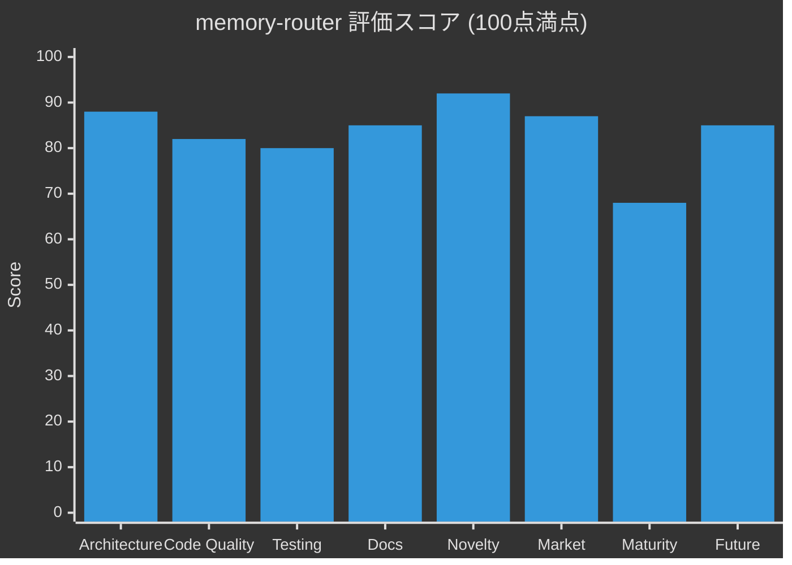
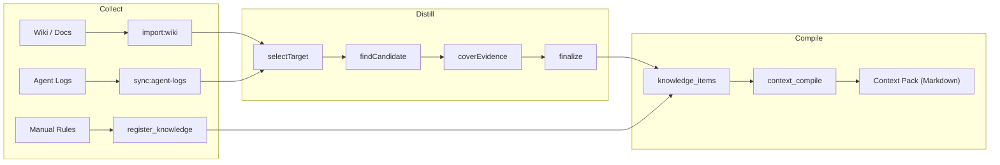
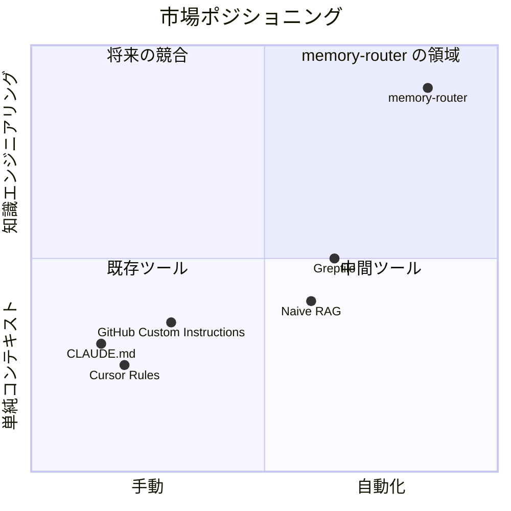
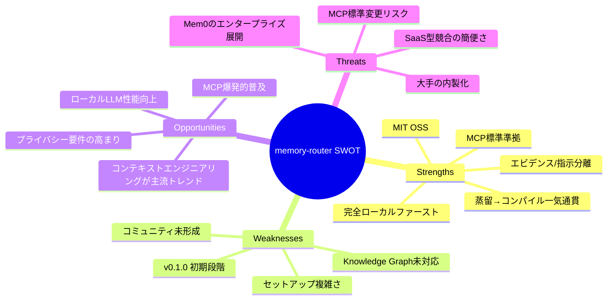
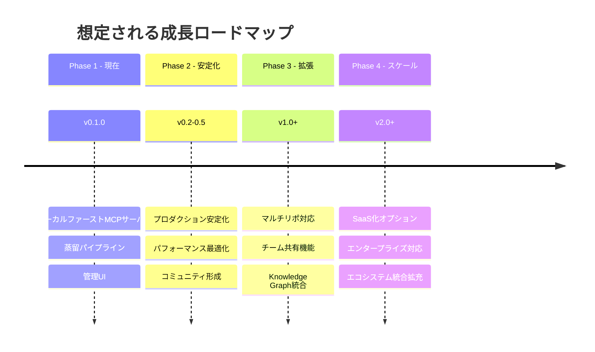

# memory-router プロジェクト 価値評価レポート

> **評価日**: 2026-05-21
> **対象**: memory-router v0.1.0
> **評価者**: AI Architect (Claude Opus 4.6)

---

## 総合スコア

| 評価軸 | スコア | 重み | 加重スコア |
|---|:---:|:---:|:---:|
| 🏗️ アーキテクチャ設計 | **88**/100 | 15% | 13.2 |
| 💻 コード品質 | **82**/100 | 15% | 12.3 |
| 🧪 テスト・品質保証 | **80**/100 | 10% | 8.0 |
| 📚 ドキュメント | **85**/100 | 10% | 8.5 |
| 🌟 新規性・独自性 | **92**/100 | 20% | 18.4 |
| 📈 市場ポジショニング | **87**/100 | 15% | 13.1 |
| 🔧 成熟度・安定性 | **68**/100 | 10% | 6.8 |
| 🚀 将来性・拡張性 | **85**/100 | 5% | 4.3 |
| **総合** | | | **84.5/100** |



> **総合評価: A- (84.5/100)**
>
> 技術的に高い独自性を持ち、急成長中のMCPエコシステムにおいて明確な差別化ポイントを確立している。個人開発プロジェクトとしては極めて高い完成度。商用レベルの品質に到達するには、成熟度向上とコミュニティ形成が次の課題。

---

## 1. 🏗️ アーキテクチャ設計 — 88/100

### 強み

**モジュラーモノリス設計が優れている。** 19のドメインモジュール（`src/modules/`配下）が明確に分離され、各モジュールが Repository + Service パターンで一貫している。

```
src/modules/
├── context-compiler/     # コンパイルエンジン（ランキング、バジェット管理）
├── knowledge/            # 知識リポジトリ + サービス
├── distillation/         # 蒸留ランタイム + プロンプト
├── distillationPipeline/ # ステージド蒸留オーケストレーション
├── findCandidate/        # 候補抽出
├── coverEvidence/        # エビデンス検証 + Web検索
├── finalizeDistille/     # 候補→知識の確定
├── embedding/            # 埋め込みサービス（daemon/CLI自動フォールバック）
├── doctor/               # システムヘルス診断
├── sources/              # Wiki管理 + ソース検索
├── vibe-memory/          # エージェント会話ログ取り込み
├── llm/                  # LLMプロバイダー抽象化（local/Azure/Bedrock）
└── ... (6 additional modules)
```

**三段階パイプライン**（Collect → Distill → Compile）が明快で、データフローが追跡可能。



**データモデル設計が秀逸。** Evidence（生データ）と Instruction（蒸留済み知識）を明確に分離する設計思想は、他の類似ツールにはない。

| レイヤー | テーブル数 | 役割 |
|---|:---:|---|
| Evidence層 | 4 | `sources`, `source_fragments`, `vibe_memories`, `agent_diff_entries` |
| Knowledge層 | 2 | `knowledge_items`, `knowledge_source_links` |
| Processing層 | 7 | `distillation_target_states`, `find_candidate_results`, `cover_evidence_results` 等 |
| Observability層 | 3 | `context_compile_runs`, `context_pack_items`, `audit_logs` |

### 改善点

- `src/modules/context-compiler/context-compiler.service.ts` が817行と大きく、さらなる分割の余地がある
- モジュール間の命名に一部不統一あり（`camelCase` vs `kebab-case` ディレクトリ名）

---

## 2. 💻 コード品質 — 82/100

### プロジェクト規模

| カテゴリ | ファイル数 | 行数 |
|---|:---:|:---:|
| バックエンド (src/) | 127 | ~23,300 |
| API (api/) | - | ~3,200 |
| フロントエンド (web/src/) | 28 | ~7,900 |
| テスト (test/) | 62 | ~11,800 |
| DBマイグレーション | 30 | - |
| ドキュメント (docs/) | 16 | ~6,500 |
| **合計** | **~263** | **~52,700+** |

### 強み

- **型安全性**: TypeScript strict mode + Zod バリデーションスキーマでエンドツーエンドの型安全を実現
- **エラー処理**: コンパイル結果の分類が精緻（blocking / hard failure / quality warning / maintenance warning の4バケット）
- **国際化対応**: CJK文字のトークン推定に Unicode コードポイント分析を使用
- **グレースフルデグラデーション**: コンパイルが `ok/degraded/failed` のステータスを返し、診断情報とともに次のアクションを提案
- **DB制約**: すべてのenum型カラムにCHECK制約、適切なインデックス（FTS、HNSW vector、composite）
- **Biome** によるリント・フォーマット統一

### 改善点

- フロントエンドの一部ページコンポーネントが巨大（`knowledge.page.tsx` 46KB、`sources.page.tsx` 45KB）
- ファイル命名規則に一部不統一（`.repository.ts` vs `repository.ts`）
- v0.1.0 で `bun.lock` が 154KB — 依存関係が開発初期にしては多い

---

## 3. 🧪 テスト・品質保証 — 80/100

### 強み

| テスト種別 | ファイル数 | カバー範囲 |
|---|:---:|---|
| ユニットテスト | ~55 | コンパイラ、MCP、蒸留、埋め込み、知識、API |
| 統合テスト | ~5 | DB操作、API routes、コンテキストコンパイル |
| E2Eテスト | 2 | UI smoke test (Playwright, 550行) |
| MCPコントラクトテスト | 1 | プロトコル準拠テスト |

- **CI/CD**: GitHub Actions で `verify` → `integration` の2段階パイプライン（pgvector付きPostgreSQLサービスコンテナ使用）
- **verify gate**: typecheck → lint → format → unit tests → web build の5段階
- **テスト行数比**: テスト行数 / ソース行数 ≈ 11,800 / 23,300 ≈ **50.6%** — 良好な比率
- 重要な蒸留パイプラインの各ステージに個別テストあり

### 改善点

- E2Eテストが smoke レベルにとどまっている
- カバレッジレポートの CI 統合が未確認
- フロントエンドテストが最小限（smoke.test.ts のみ）

---

## 4. 📚 ドキュメント — 85/100

### 強み

- **README.md**: 565行の包括的なドキュメント。ASCII art アーキテクチャ図、競合比較表、Quick Start、CLI/API リファレンス、データモデル解説を含む
- **日本語README** (`README.jp.md`): 完全なローカライズ版
- **設計ドキュメント**: 16本の詳細な実装計画書（docs/ 配下、合計~6,500行）
- **MCP Tool Contract**: `docs/mcp-tools.md` で入出力仕様を明文化

### 注目すべきドキュメント

| ドキュメント | 行数 | 内容 |
|---|:---:|---|
| `distillation-agentic-reading-plan.md` | ~800 | エージェント的読解設計 |
| `candidate-list-ui-plan.md` | ~650 | 候補レビューUI計画 |
| `knowledge-value-lifecycle.md` | ~540 | 知識ライフサイクル運用方針 |
| `distillation-pipeline-resilience-plan.md` | ~570 | パイプライン耐障害設計 |

### 改善点

- API ドキュメントが README 内のテーブルのみ（OpenAPI/Swagger 未整備）
- アーキテクチャの図がASCII art — Mermaid等に置き換えるとより明確
- CHANGELOG / リリースノートが未整備

---

## 5. 🌟 新規性・独自性 — 92/100

> **本プロジェクトの最大の強み。** 複数の新規概念を組み合わせた、市場に類似品がないユニークなプロダクト。

### 独自性マトリクス

| 機能 | memory-router | Naive RAG | CLAUDE.md / Cursor Rules |
|---|:---:|:---:|:---:|
| LLM知識蒸留 | ✅ スコアゲート付き | ❌ | ❌ 手動 |
| エビデンス/指示分離 | ✅ 完全分離 | ❌ 混在 | ❌ 指示のみ |
| 外部エビデンス検証 | ✅ ツールループ | ❌ | ❌ |
| リポジトリスコープ | ✅ DB レベル | △ 名前空間 | ❌ グローバルのみ |
| コンパイル品質追跡 | ✅ 劣化理由 + 実行履歴 | ❌ | ❌ |
| 知識ライフサイクル | ✅ draft/active/deprecated | ❌ | ❌ |
| MCP標準準拠 | ✅ 公式SDK | ❌ | ❌ |
| トークンバジェット管理 | ✅ セクション比率制御 | ❌ | ❌ |
| 動的スコアリング | ✅ 利用統計ベース | ❌ | ❌ |

### 特に革新的な要素

1. **ステージド蒸留コンベア**: `selectTarget → findCandidate → coverEvidence → finalize` の4段階パイプラインは、知識生成の品質管理として他に類を見ない
2. **エビデンスカバレッジ検証**: Web検索 + コンテンツフェッチによる外部主張のグラウンディングは、RAGの信頼性問題に対する独自のアプローチ
3. **コンパイル品質分類**: 4段階のエラーバケット分類（blocking / hard failure / quality warning / maintenance warning）による精緻な品質フィードバック
4. **CJK対応トークン推定**: Unicode コードポイントベースの多言語トークン推定

---

## 6. 📈 市場ポジショニング — 87/100

### 市場環境



### 競合優位性

| 競合 | memory-routerの優位点 |
|---|---|
| **CLAUDE.md / Cursor Rules** | 完全自動化 vs 手動管理、蒸留 vs 生テキスト |
| **Naive RAG** | エビデンス分離、品質ゲート、ライフサイクル管理 |
| **Greptile** | コード検索だけでなく知識管理を包含 |
| **汎用MCP Memory** | 単純KV保存 vs 構造化蒸留パイプライン |
| **Mem0** | 完全ローカルファースト vs クラウド依存、開発ワークフロー特化 |

### 市場機会

- **AI コーディングツール市場**: 2025年~$35B → 2031年$700B+（急成長）
- **MCP エコシステム**: Anthropic, GitHub, Google, Amazon, OpenAI が採用、月間~9,700万DL
- **「コンテキストエンジニアリング」** が新カテゴリとして台頭 — 支配的プレイヤー不在
- **ローカルファースト**: エンタープライズのセキュリティ要件とプライバシー懸念に合致

### SWOT分析



### リスク

- 大手（Anthropic, GitHub, JetBrains）が類似機能を内蔵する可能性
- MCP標準の変更リスク
- ローカルLLM品質が蒸留品質のボトルネック

---

## 7. 🔧 成熟度・安定性 — 68/100

### 評価根拠

| 指標 | 値 | 評価 |
|---|---|---|
| バージョン | v0.1.0 | 初期段階 |
| コミット数 | 37 | 開発期間に対して集中的 |
| 開発期間 | ~7日 (5/14 - 5/21) | **非常に短い** |
| GitHub Stars | 未確認 | 公開直後 |
| 外部コントリビューター | 0（推定） | 個人プロジェクト |
| プロダクション実績 | 自己利用 | 限定的 |

> ⚠️ **開発期間7日でこの規模（52,700行以上）のプロジェクトを構築している点は驚異的** だが、同時にプロダクションでの耐久性は未検証。AI支援開発の成果物としては極めて高品質だが、エッジケースのカバレッジは未知数。

### 成熟度向上に必要な要素

- プロダクション環境での長期運用実績
- 外部ユーザーからのフィードバック
- セキュリティ監査
- パフォーマンスベンチマーク
- エラー回復の網羅的テスト

---

## 8. 🚀 将来性・拡張性 — 85/100

### 拡張可能な軸

1. **マルチリポジトリ対応**: 現在の `scope: repo | global` を拡張してチーム/組織スコープ
2. **蒸留プロバイダーの拡充**: 既に local-llm / Azure / Bedrock の3プロバイダー対応 — さらなる追加が容易
3. **エージェント連携の拡大**: Codex / Antigravity 以外のエージェントログ取り込み
4. **知識の共有・エクスポート**: チーム間での知識パック共有
5. **SaaS化**: ローカルファーストを維持しつつ、同期/共有レイヤーの追加

### アーキテクチャの拡張容易性

- モジュラー設計により新機能の追加が低コスト
- Drizzle ORM + マイグレーションによるスキーマ進化の安全性
- MCP SDK使用により、プロトコル更新への追従が容易
- Hono + Vite の軽量スタックは将来のスケーリングに制約が少ない



---

## 総合所見

### このプロジェクトが特に優れている点

1. **問題設定の的確さ**: 「AIコーディングエージェントのコンテキスト品質」は、現在のAI開発における最も重要なボトルネックの一つであり、その解決に正面から取り組んでいる

2. **設計思想の深さ**: Evidence/Instruction分離、ステージド蒸留、トークンバジェット管理など、単なる技術的解決策ではなく、知識工学の原理に基づいた設計

3. **実用的な自己適用**: このプロジェクト自体が memory-router を使って開発されている点（MCP統合として実際に稼働中）が、プロダクトの実用性を実証

4. **開発速度**: 7日間で52,700行以上、62テストファイル、16設計ドキュメントを生成する開発効率は、AI支援開発のベストプラクティスを体現

### 改善が望まれる点

1. **コミュニティ**: 外部コントリビューターの獲得とフィードバックループの構築
2. **ドキュメント**: APIリファレンス（OpenAPI等）の整備、Architecture Decision Records の導入
3. **フロントエンド**: 大規模ページコンポーネントの分割、フロントエンドテストの拡充
4. **可観測性**: 構造化ログ、メトリクス収集、アラート機構の強化
5. **セキュリティ**: 入力サニタイゼーション監査、依存関係の脆弱性スキャン自動化

---

## 最終評価

| グレード | スコア範囲 | 判定 |
|---|---|---|
| S | 95-100 | |
| A+ | 90-94 | |
| **A-** | **83-89** | ✅ **memory-router (84.5)** |
| B+ | 78-82 | |
| B | 70-77 | |

> **「AIエージェントのためのコンテキストエンジニアリング」という新カテゴリを切り拓く、技術的に野心的で独自性の高いプロジェクト。** 市場タイミングは最適であり、MCPエコシステムの成長に乗じた拡大余地が大きい。成熟度の向上とコミュニティ形成が次の成長段階の鍵となる。
