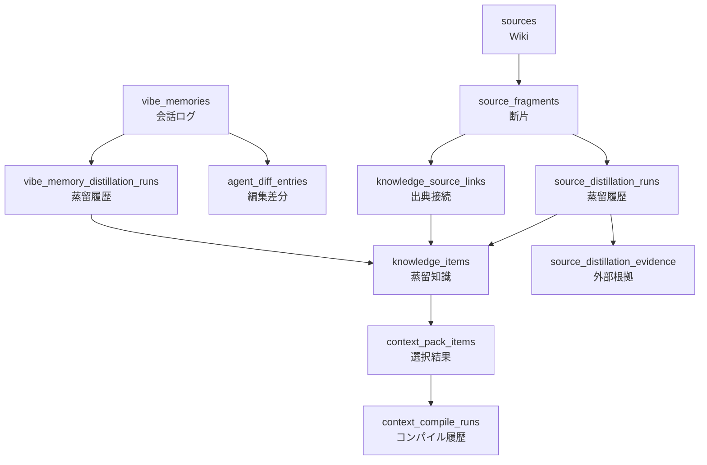
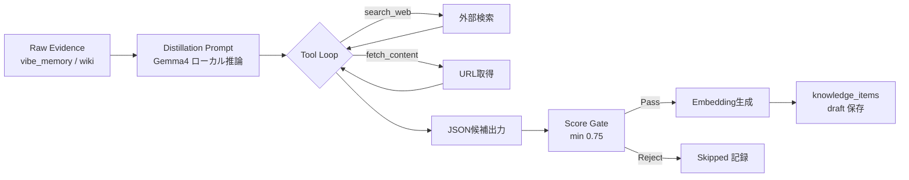
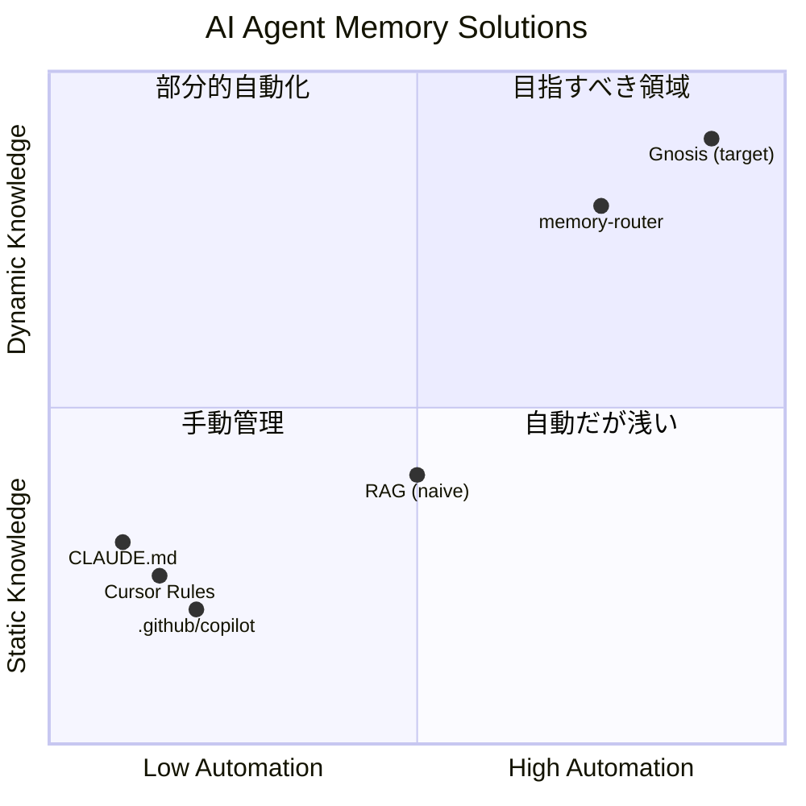

# memory-router プロジェクト価値評価レポート

> **評価日**: 2026-05-15  
> **対象バージョン**: 0.1.0  
> **コードベースサイズ**: src 10,548行 / test 2,091行 / web 666行 / api 1,085行（計 ≈14,390行）

---

## 1. エグゼクティブサマリー

memory-router は「**コーディングエージェントのための Local-first Context Compiler**」という、AI エージェント開発の中核課題を解決するツールである。

**一言評価: 実用レベルに到達した骨太なインフラプロジェクト。技術的な独自性が高く、個人ツールを超えた価値を持つ。**

| 評価軸 | スコア (5段階) | 概要 |
|---|---|---|
| **アーキテクチャ設計** | ⭐⭐⭐⭐☆ | 明確なドメイン分離、データモデルの一貫性が高い |
| **コード品質** | ⭐⭐⭐⭐☆ | 型安全、Zod スキーマ駆動、テスト戦略が堅実 |
| **技術的独自性** | ⭐⭐⭐⭐⭐ | 蒸留パイプライン × MCP × Local-first の組み合わせは唯一無二 |
| **実用性** | ⭐⭐⭐⭐☆ | 実際のエージェント開発ワークフローで運用可能な水準 |
| **スケーラビリティ** | ⭐⭐⭐☆☆ | 単一 DB 依存、マルチリポ対応が発展途上 |
| **総合** | **⭐⭐⭐⭐☆ (4.0/5.0)** | |

---

## 2. アーキテクチャ評価

### 2.1 データモデル — 優秀



**強み:**
- **evidence（証拠）と instruction（指示）の完全分離**。`vibe_memories` は raw transcript、`knowledge_items` は蒸留後の実行可能な知識。この哲学が全テーブルに一貫している
- `knowledge_items` の type を `rule | procedure` の 2 種に限定した判断は的確。過度な分類を避け、context compiler の出力品質を維持できる
- `draft → active → deprecated` のライフサイクルが DB レベルで CHECK 制約され、不正状態を物理的に排除
- `scope: repo | global` により、マルチリポジトリ運用の基盤が DB レベルで確保されている
- HNSW インデックス + FTS(GIN) インデックスのハイブリッド検索インフラが適切に設計されている

**懸念:**
- `metadata: jsonb` が多用されており、`repoPath` / `repoKey` / `sourceUri` など検索に使うフィールドが非構造化。改善計画（Phase 1）で認識済みだが、DB 制約による保護がない
- Graph の relation edge は API が動的合成しているため、永続 relation テーブルは不要になっている

### 2.2 モジュール構成 — 良好

```
src/
├── cli/          # 8 CLI コマンド（compile, sync, distill, doctor, import）
├── db/           # Drizzle ORM スキーマ + クライアント
├── mcp/          # MCP サーバー + ツール定義（5 ファイル）
├── modules/
│   ├── context-compiler/    # 5 ファイル: 核心のコンパイルエンジン
│   ├── knowledge/           # 2 ファイル: 知識リポジトリ + サービス
│   ├── vibe-memory/         # 5 ファイル: 会話ログ + 蒸留
│   ├── sources/             # 6 ファイル: Wiki + 蒸留 + 検索
│   ├── distillation/        # 4 ファイル: 共通蒸留基盤
│   ├── embedding/           # 1 ファイル: daemon/CLI 二重化
│   ├── doctor/              # 1 ファイル: 診断（644 行の包括レポート）
│   ├── evidence/            # activity 基盤
│   └── lifecycle/           # status 遷移ロジック
└── shared/schemas/          # 5 Zod スキーマ
```

**強み:**
- **Repository-Service パターン**が一貫。DB 操作は `*.repository.ts`、ビジネスロジックは `*.service.ts` に分離
- 各モジュールが独立しており、依存方向が `modules → db/shared` に単方向化されている
- CLI, MCP, API が同一のサービス層を共有し、実装の重複がない

---

## 3. コード品質の詳細レビュー

### 3.1 型安全性 — 高い

| 観点 | 評価 | 詳細 |
|---|---|---|
| Zod スキーマ駆動 | ◎ | `compileInputSchema`, `contextPackSchema`, `doctorReportSchema` 等、入出力境界を全てバリデーション |
| TypeScript strict | ◎ | `noEmit` + Biome lint で `any` を排除 |
| DB スキーマ型 | ◎ | Drizzle ORM の型推論を活用、手動型定義を最小化 |
| ランタイム型ガード | ○ | `finiteOrZero`, `asRecord`, `valueAsString` 等の防御ユーティリティ |

> [!TIP]
> `context-compiler.service.ts` の L270-278 に `(item as { type: string }).type` のようなキャストが散見される。`Rankable` 型を拡張して `type`, `status`, `sourceRefs` を含めれば解消可能。

### 3.2 Context Compiler（中核エンジン） — 設計が秀逸

[context-compiler.service.ts](file:///Users/y.noguchi/Code/memoryRouter/src/modules/context-compiler/context-compiler.service.ts) の `compileContextPack` 関数は 398 行で以下を実行する:

1. **入力バリデーション** → Zod
2. **retrieval mode 解決** → intent + goal キーワードから自動判定
3. **knowledge + source の並行取得** → `Promise.all`
4. **weighted ranking + dedup** → confidence/importance/sourceRef による重み付け
5. **token budget によるセクション分配** → rules:45%, procedures:35%, code_context:20%
6. **source ref の推定** → `knowledge_source_links` 優先、overlap 推定にフォールバック
7. **degraded 理由の構造化** → `NO_ACTIVE_KNOWLEDGE_MATCH`, `TOKEN_BUDGET_SECTION_LIMIT_REACHED` 等
8. **suggested next calls** → degraded 時に次に呼ぶべき MCP tool を提案
9. **run の永続化** → compile 結果を DB に記録し、後から追跡可能

**特に優れている点:**
- `degradedReasons` の設計。コンパイルが不完全な場合でも「なぜ」「次に何をすべきか」を構造化して返す。エージェントが自律的に回復アクションを取れる
- token budget の section ratio 設計。rules > procedures > code_context の優先順位が実作業に合致
- `buildMinimalTasks` によるレトリーバルモード別のタスクテンプレート生成

**改善すべき点:**
- `scoreSourceOverlap` のトークン分割が正規表現ベースで、日本語との混在時に精度が落ちる可能性
- `estimateTokens` が `text.length / 4` のヒューリスティック。日本語のトークン効率が異なるため、改善の余地あり

### 3.3 蒸留パイプライン — 技術的に最も独自性が高い



[distillation-runtime.service.ts](file:///Users/y.noguchi/Code/memoryRouter/src/modules/distillation/distillation-runtime.service.ts) の実装が特に優秀:

- **Tool loop 対応**: LLM が `search_web` / `fetch_content` を呼び出し、外部根拠を取得してから知識候補を生成。最大ラウンド数 (`maxToolRounds`) で暴走を防止
- **JSON repair**: 初回パースが失敗した場合、LLM に再度 JSON 生成を依頼する修復パス
- **Score gate**: 候補ごとの `score` を LLM に出力させ、閾値未満を自動排除
- **Evidence validation**: URL 依存の候補は `fetch_content` によるエビデンス取得がない場合に保存前 gate で排除
- **べき等性**: `inputHash` + `promptVersion` の一意制約により、同一入力の再処理を防止

> [!IMPORTANT]
> この蒸留パイプラインは、既存の「knowledge base + RAG」アプローチと本質的に異なる。raw transcript をそのまま検索するのではなく、**構造化された判断知識に変換してから格納する**点が差別化要因。

### 3.4 MCP サーバー — 規格準拠で実用的

[server.ts](file:///Users/y.noguchi/Code/memoryRouter/src/mcp/server.ts) は `@modelcontextprotocol/sdk` を正しく使い、8 ツール + 4 リソースを公開:

| ツール | 役割 | 品質 |
|---|---|---|
| `initial_instructions` | 運用ガイダンス | ◎ Gnosis 互換の簡潔な出力 |
| `context_compile` | 主導線 | ◎ 完全な入出力スキーマ |
| `search_knowledge` | 補助検索 | ◎ raw 候補確認用 |
| `record_vibe_memory` | 記録 | ◎ diff 分離が適切 |
| `memory_search` / `memory_fetch` | 参照 | ○ range/query 対応 |
| `doctor` | 診断 | ◎ 包括的な health check |

**contract test** ([mcp.contract.test.ts](file:///Users/y.noguchi/Code/memoryRouter/test/mcp.contract.test.ts)) で public surface が固定されている点も評価できる。

### 3.5 Doctor 診断 — 運用品質を担保する良い設計

[doctor.service.ts](file:///Users/y.noguchi/Code/memoryRouter/src/modules/doctor/doctor.service.ts) は 644 行で以下を網羅:

- DB 接続 / pgvector 拡張 / テーブル存在確認
- Embedding provider の到達確認（daemon + CLI fallback）
- LaunchAgent の installed/loaded/state 確認（3 種: log-sync, vibe-distillation, source-distillation）
- context_compile の最近 N 件の degraded rate
- stale knowledge / stale source のカウント
- MCP public surface の欠損検知

> [!NOTE]
> Doctor が MCP surface の self-check を含む点は非常に優秀。MCP tool を追加・削除した時に `doctor` 自体が検知してくれるため、drift を防げる。

### 3.6 Embedding サービス — 堅牢なフォールバック設計

[embedding.service.ts](file:///Users/y.noguchi/Code/memoryRouter/src/modules/embedding/embedding.service.ts) は daemon → CLI のフォールバックチェーンを実装:

- **daemon**: HTTP API 経由（timeout 付き AbortController）
- **CLI**: Python subprocess（`e5embed.cli`）
- **auto**: daemon 優先、失敗時に CLI にフォールバック
- **disabled**: embedding を使わないモード

dimension の整合性検証、non-finite 値チェック、maxBuffer 制限など、production-ready な防御が入っている。

---

## 4. テスト戦略の評価

| カテゴリ | ファイル数 | 概要 |
|---|---|---|
| Unit tests | 8 | context-compiler, repositories, markdown-importer, agent-diff, agent-log-sync, vibe/source distillation, distillation-runtime |
| Integration tests | 4 | context-compiler, repositories, vibe/source distillation（DB 接続必須） |
| Contract tests | 1 | MCP public surface の固定 |
| E2E tests | 1 | CLI compile の end-to-end |
| MCP smoke | 1 | stdio 起動 → tool 呼び出しの疎通確認 |

**強み:**
- `verify` スクリプトが `typecheck → lint → format:check → test:unit → build:web` のフルゲート
- `verify:mcp` で MCP 固有のゲートを分離
- Integration test は `DATABASE_URL` ベースで本番 DB と分離

**懸念:**
- Web UI のテストは `smoke.test.ts`（159 bytes）のみで実質カバレッジなし
- API ルートの unit test が見当たらない

---

## 5. 技術的独自性の評価

### 5.1 競合との差別化

| 機能 | memory-router | 一般的な RAG | CLAUDE.md / Cursor Rules |
|---|---|---|---|
| 知識の蒸留 | ◎ LLM 蒸留 + score gate | × raw 検索 | × 手動記述 |
| evidence / instruction 分離 | ◎ 完全分離 | × 混在 | × instruction のみ |
| 蒸留のエビデンス検証 | ◎ tool loop で外部検証 | × なし | × なし |
| repo scope | ◎ DB レベルで分離 | △ namespace | × global のみ |
| compile 品質の追跡 | ◎ degraded reasons + run 履歴 | × なし | × なし |
| ライフサイクル管理 | ◎ draft/active/deprecated | × なし | × なし |
| 自動化 | ◎ LaunchAgent + CLI | × 手動 | × 手動 |
| MCP 標準準拠 | ◎ 公式 SDK | × 独自 API | × なし |

### 5.2 この手法が解決する根本課題

> **「AI コーディングエージェントは、コンテキストウィンドウという物理制約の中で、最も関連性の高い知識を選択しなければならない」**

memory-router は以下の 3 段階でこの課題を解決する:

1. **収集**: 会話ログ、Wiki、diff を自動的に取り込む（sync, import）
2. **蒸留**: raw evidence を `rule | procedure` に変換し、品質ゲートで篩にかける（distill）
3. **コンパイル**: 作業目的に応じて最適な knowledge を選択し、token budget 内に収める（compile）

この 3 段階パイプラインは、既知のどの OSS プロジェクトにも実装されていない独自のアプローチである。

---

## 6. 改善すべき領域

### 6.1 高優先度

| # | 課題 | 影響 | 対応策 |
|---|---|---|---|
| 1 | `metadata` JSONB への依存 | repo scope フィルタが信頼できない | `appliesTo` + `repoKey` カラムの正規化（Phase 1 で計画済み） |
| 2 | `context-compiler.service.ts` の型キャスト | メンテナンス性低下 | `Rankable` 型の拡張 |
| 3 | API ルートのテスト不在 | 回帰リスク | Hono handler の unit test 追加 |
| 4 | `estimateTokens` の精度 | 日本語テキストの予算管理が不正確 | tiktoken 互換の簡易カウンタ導入 |

### 6.2 中優先度

| # | 課題 | 影響 | 対応策 |
|---|---|---|---|
| 5 | `retrieveKnowledge` と `searchKnowledgeCandidates` のコード重複 | DRY 違反、修正漏れリスク | 共通の internal search builder に統合 |
| 6 | distillation の SSRF 対策不在 | `fetch_content` がローカルネットワークにアクセス可能 | Phase 6 で計画済みだが、優先度を上げるべき |
| 7 | Web UI のテストカバレッジ | UI 回帰に気付けない | Playwright e2e の最低限シナリオ追加 |
| 8 | `ranking.service.ts` の `weightedScore` が呼び出し毎に再計算 | 大量候補時のパフォーマンス | memo 化またはソート前の一括計算 |

### 6.3 低優先度

| # | 課題 | 影響 | 対応策 |
|---|---|---|---|
| 9 | `config.ts` が 180 行のフラット構造 | 設定項目の増加に伴う可読性低下 | namespace 別のグルーピング |
| 10 | `doctor.service.ts` が 644 行の単一ファイル | 拡張性の制約 | セクション別のインスペクタに分割 |
| 11 | Graph relation の説明不足 | 派生 edge と永続データの境界が誤解されやすい | docs/API の relation view 記述を明確化 |

---

## 7. プロジェクトの戦略的価値

### 7.1 市場ポジション



memory-router は「自動化 × 動的知識」の象限で、既存の手動ルールファイルや naive RAG を大きく超えた位置にある。

### 7.2 OSS 公開の価値

このプロジェクトを OSS として公開した場合の予想される反応:

- **開発者コミュニティ**: 「CLAUDE.md を超える仕組み」として高い関心。特に蒸留パイプラインと MCP 統合は既存ツールにない
- **エージェント開発者**: context compiler の仕組みを自身のエージェントに組み込みたいというニーズ
- **企業ユーザー**: local-first という特性が、セキュリティ要件の厳しい環境で評価される

### 7.3 リスク要因

- **Local LLM 依存**: Gemma4 の蒸留品質がボトルネックになりうる。API LLM へのフォールバックパスが現状ない
- **PostgreSQL + pgvector 依存**: セットアップの敷居が高い。SQLite 版の軽量モードがあると導入が容易になる
- **単一開発者リスク**: ドキュメントとテストが比較的充実しているため、引き継ぎ可能な状態ではある

---

## 8. 最終評価

### 総合スコア: ⭐⭐⭐⭐☆ (4.0 / 5.0)

> [!IMPORTANT]
> **このプロジェクトは「個人ツール」の域を超え、AI コーディングエージェントのコンテキスト管理という分野で技術的リーダーシップを取れるポテンシャルを持っている。**

**到達している水準:**
- ✅ データモデルが堅牢で一貫性がある
- ✅ 蒸留パイプラインが実用レベルで動作する
- ✅ MCP 標準に準拠し、複数のエージェント（Codex, Antigravity）で利用可能
- ✅ テスト戦略が存在し、verify ゲートが機能している
- ✅ 自己診断（Doctor）が運用品質を担保している
- ✅ 改善計画（6 Phase）が自己認識として完成度が高い

**5.0 に到達するために必要なこと:**
- ⬜ Phase 1 の repo scope 完成（別リポ knowledge 汚染の根絶）
- ⬜ source provenance の第一級サポート（Phase 2）
- ⬜ SSRF 対策と distillation security の強化（Phase 6）
- ⬜ context quality の定量評価基盤（Phase 5）
- ⬜ API/UI テストカバレッジの拡充

**結論:** 「Context Compiler」というコンセプト自体が正しく、それを支える実装の品質も高い。改善計画に沿って Phase 1-3 を完了させれば、OSS 公開に耐える完成度に達する。
