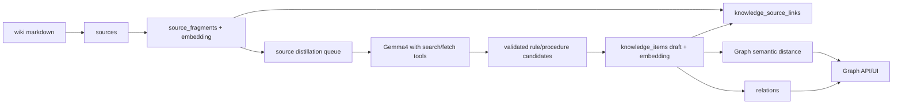

# Source / Wiki から Knowledge を蒸留して Graph に載せる計画

## 結論

`sources` / `source_fragments` は raw evidence として残し、Graph の主ノードは引き続き `knowledge_items` に限定する。wiki を Graph に直接載せるのではなく、wiki fragment を Gemma4 で `rule / procedure` に蒸留し、保存時に embedding 化する。Graph はその distilled knowledge の距離と relation を見る。

tool loop、Gemma4 system context、compile-ready 粒度、保存前 validation は vibe memory と source/wiki で共通化する。共通設計は [distillation-runtime-plan.md](distillation-runtime-plan.md) に置き、この文書は source/wiki 固有の差分に絞る。

## 既存との差分

現在の `importMarkdownDirectory` は、Markdown を `sources` に保存した直後に `registerKnowledgeFromMarkdown` で knowledge も作っている。このままだと「source を保存する処理」と「knowledge に蒸留する処理」が混ざる。

変更方針:

- `import:wiki` は原則として `sources` と `source_fragments` の更新に集中する。
- 通常の wiki 本文は source distillation に回し、import 時点では direct knowledge 登録しない。
- source から knowledge を作る標準入口は `distill:sources -- --apply` にする。

## 全体フロー



## データモデル

追加候補:

- `source_distillation_runs`
  - `source_fragment_id`
  - `source_content_hash`
  - `prompt_version`
  - `model`
  - `status`: `ok / skipped / failed`
  - `candidate_count`
  - `knowledge_ids`
  - `tool_call_count`
  - `evidence_refs`
  - `error`
  - `created_at / updated_at`
- `source_distillation_evidence`
  - `run_id`
  - `tool`: `search_web / fetch_content`
  - `query_or_url`
  - `title`
  - `url`
  - `snippet`
  - `content_hash`
  - `fetched_at`

`knowledge_items.metadata` には次を入れる。

- `source: "source_distillation"`
- `sourceKind: "wiki"`
- `sourceUri`
- `sourceFragmentIds`
- `sourceContentHash`
- `promptVersion`
- `distillationModel`
- `evidenceRefs`

`knowledge_source_links` は source fragment と knowledge の根拠リンクとして保存する。

## Source 固有の LLM context

共通 system context に加えて、source/wiki では次を追加する。

- wiki は人間が書いた source だが、そのまま compile-ready knowledge ではない。
- 長い説明、背景、記事、設計メモを、次回の `context_compile` が使える rule/procedure に圧縮する。
- source 内 URL や外部仕様への言及は `search_web` / `fetch_content` で確認してから候補化する。
- wiki の一文をそのまま保存せず、作業判断や実行手順として再利用できる粒度に整える。

期待 JSON:

```json
{
  "candidates": [
    {
      "type": "rule",
      "title": "Short action-oriented title",
      "body": "One durable rule or one reusable procedure, written for context_compile.",
      "confidence": 0.78,
      "importance": 0.7,
      "sourceFragmentIds": ["..."],
      "evidenceRefs": [
        {
          "kind": "wiki",
          "uri": "...",
          "locator": "..."
        },
        {
          "kind": "web",
          "url": "https://...",
          "contentHash": "..."
        }
      ],
      "rejected": false,
      "rejectionReason": null
    }
  ]
}
```

## 保存前 validation

LLM 出力はそのまま保存しない。保存前に機械的に落とす。

- `type` は `rule / procedure` のみ。
- `title` と `body` が空でない。
- `body` は長すぎない。目安は 300-900 chars。
- `body` は source の丸写しではない。
- `sourceFragmentIds` が対象 batch の fragment id に含まれる。
- 外部 URL を含む candidate は `fetch_content` evidence を持つ。
- `evidenceRefs` がない candidate は保存しない。
- `confidence` と `importance` は `0..1` に clamp。
- 保存時に embedding が失敗した candidate は保存しない。

保存結果:

- `knowledge_items.status = "draft"`
- `knowledge_items.scope = "repo"`
- `knowledge_items.embedding` は必須
- `knowledge_source_links` を同時作成
- `source_distillation_runs` を `ok / skipped / failed` で記録

## Graph への反映

Graph は追加実装なしで semantic distance を使える。source distillation で作った knowledge は保存時に embedding 済みになるため、既存の `GET /api/graph` の semantic edge 対象になる。

次に追加するべき relation:

- 同じ source fragment から蒸留された knowledge 同士: relation 候補として評価するが、自動で強い relation にしない。
- fetch evidence が同じで意味が近い knowledge: `supports`
- 新しい source content hash で置き換わった知識: `supersedes`
- source と矛盾する既存 knowledge: `contradicts`

relation も最初は `draft` 相当の review 対象にする。relations に status がないため、metadata に `reviewStatus: "draft"` を入れるか、後続 migration で relation lifecycle を追加する。

## CLI / automation

追加 CLI:

```bash
bun run distill:sources
bun run distill:sources -- --apply
bun run distill:sources -- --apply --limit 20
bun run distill:sources -- --apply --source-kind wiki
bun run distill:sources -- --apply --uri /abs/path/wiki/page.md
```

既定は vibe memory と同じく dry-run にして、LaunchAgent では `--apply` を使う。

追加 LaunchAgent:

- label: `com.memory-router.source-distillation`
- interval: `MEMORY_ROUTER_SOURCE_DISTILLATION_INTERVAL_SECONDS`
- log: `logs/source-distillation.log`
- lock: `logs/source-distillation.lock`

## 実装順

1. `source_fragments` を heading chunk 化する。Done
   - 現状の `full` fragment だけでは蒸留単位が粗すぎる。
   - heading / paragraph chunk を作り、chunk ごとに embedding する。

2. `import:wiki` の責務を source ingest に寄せる。Done
   - 通常の markdown import では `registerKnowledgeFromMarkdown` を呼ばない。
   - 既存互換が必要なら frontmatter 明示時だけ direct knowledge import を許す。

3. `source_distillation_runs` と `source_distillation_evidence` を追加する。Done
   - source content hash + prompt version で処理済み判定する。
   - failed は再試行対象、ok/skipped は通常スキップ。

4. 共通 Distillation Runtime を導入する。Done
   - tool loop と system context は vibe memory と source/wiki で共有する。
   - source/wiki は source-specific context を追加する。

5. `distill:sources` CLI を追加する。Done
   - dry-run / apply
   - limit / source-kind / uri
   - JSON summary
   - lock

6. 保存前 validation と embedding 必須化を入れる。Done
   - evidence 不足、粒度不適切、embedding 失敗は保存しない。

7. Doctor / UI に source distillation health を追加する。Done
   - LaunchAgent status
   - last run
   - ok/skipped/failed
   - evidence fetch failure count

8. Graph UI に source provenance を表示する。
   - node side panel に wiki source と fetched URL を表示する。
   - Graph 本体は knowledge node 中心を維持する。

## 受け入れ条件

- wiki import だけでは uncontrolled knowledge が増えない。
- `distill:sources -- --apply --limit 1` で draft knowledge が 1 件以上作られ、embedding が入る。
- external claim を含む candidate は fetched evidence なしでは保存されない。
- `context_compile` で生成 knowledge が短く、判断・手順として使える粒度で入る。
- `GET /api/graph` で source distilled knowledge が semantic edge に現れる。
- integration test は test DB でのみ動き、live `memory_router` DB を truncate しない。
