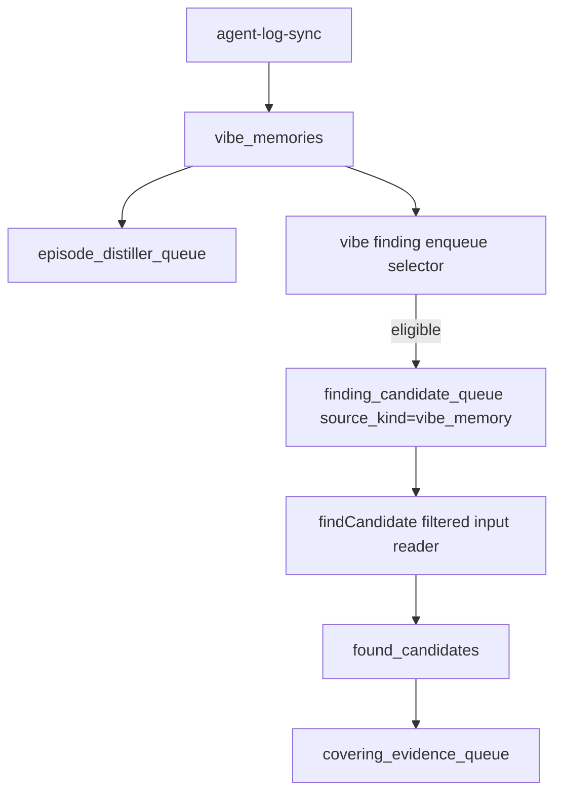

# Vibe Memory Finding Controlled Enqueue 実装計画

## 背景

Codex 履歴ログの取り込み自体は動いている。`codex_logs` 由来の `vibe_memories` は直近まで増えており、同じ新規 memory から `episode_distiller_queue` も作られている。

一方で、`finding_candidate_queue` の `source_kind='vibe_memory'` は 2026-06-27 付近で新規作成が止まっている。直近の Codex vibe memory には `episode_distiller_queue` は存在するが `finding_candidate_queue` が存在しないものがまとまって発生している。

原因は parser の全面破損ではなく、現行の TS / Rust `agent-log-sync` が新規 vibe memory 作成時に `episode_distiller_queue` だけを enqueue し、`finding_candidate_queue` へ流さない設計になっていること。

ただし、以前のように agent log chunk を無条件で finding に流す挙動へ戻してはいけない。chunk 単位の `no_candidate` が大量発生する問題を避けるため、既存の [FindCandidate Vibe Memory Filtered Input 実装計画](./findcandidate-vibe-memory-filtered-input-plan.md) と整合する controlled enqueue を正規挙動として追加する。

## 目的

- 新規 vibe memory から、条件を満たすものだけを `finding_candidate_queue` に enqueue する正規経路を追加する。
- `findCandidate` の入力は既存の deterministic filtered input reader に統一する。
- agent log sync の責務を「vibe memory / Episode job 作成」と「新規 memory に対する deterministic な controlled finding enqueue」までに限定する。
- TS と Rust の取り込み結果が、同じ選別条件・同じ queue metadata で扱えるようにする。
- live DB に溜まった未 enqueue の Codex vibe memory を、少量から安全に backfill できるようにする。

## 非目的

- agent log chunk を無条件に `finding_candidate_queue` へ戻さない。
- `findCandidate` の semantic chunk / candidatelet pipeline を復活させない。
- EpisodeDistiller の chunk 保存や queue 生成を変更しない。
- `coveringEvidence` / `finalizeDistille` の設計変更を含めない。
- live DB の既存 completed / skipped finding job を削除しない。
- LLM による事前要約や分類で enqueue 対象を決めない。

## 正規挙動

### 現行の正しい前提

- `agent-log-sync` は Codex / Antigravity / Claude logs から `vibe_memories` を作る。
- 新規 vibe memory から `episode_distiller_queue` を作る。
- `findCandidate` は `sourceInput.targetKind='vibe_memory'` を処理できる。
- vibe memory の `findCandidate` 入力は `readFilteredVibeMemoryForCandidateWindow()` を通る。

### 追加する正規経路

新しい controlled enqueue は、2つの経路で動く。

- steady-state: Rust resident `agent-log-sync` が新規 `vibe_memories` を保存した同じ transaction 内で、eligible なものだけを `finding_candidate_queue` に入れる。
- backfill / dry-run: TS CLI が既存の未 enqueue `vibe_memories` を scan し、同じ deterministic selector で少量ずつ投入できるようにする。



steady-state では、`agent-log-sync` が新規 memory の保存と同時に `findingCandidate` queue event まで記録する。これにより Codex ログ取り込みの正規経路だけで finding が再開する。

backfill は sync cursor を持たず、DB の `finding_candidate_queue` existence check を source of truth にして、過去分だけを安全に補う。

## Eligibility

### 対象にする

- `vibe_memories.metadata.sourceId` が `codex_logs`、または CLI / scheduler の `--source` で指定された source。
- `finding_candidate_queue` に同じ `source_kind='vibe_memory'`, `source_key=vibe_memories.id`, `distillation_version` の job が存在しない。
- `vibe_memories.content` が最小文字数を満たす。
- filtered input の素材として、以下のいずれかを含む。
  - ユーザーの継続的 preference / 禁止事項 / 作業境界
  - 原因、修正、検証、復旧手順
  - code review の指摘と対応
  - test / build / lint / queue / DB / daemon などの実行結果
  - `agent_diff_entries` 由来の diff / file path / command

### 低優先または除外する

- AGENTS / environment_context / initial_instructions が大半を占める chunk。
- 「確認します」「次に実行します」だけの進捗報告。
- content が短すぎる chunk。
- 同一 session の中で、ユーザー依頼だけ、または assistant の途中経過だけに偏っている chunk。
- 既に `no_candidate` 済みで、同じ distillation version かつ同じ source_key の再処理理由がないもの。

### 初期 scoring

初期実装では LLM を使わず deterministic score にする。

```ts
score =
  +40 if content contains verification/failure/fix/review keywords
  +30 if agent_diff_entries exist
  +20 if roles include both user and assistant
  +15 if content contains queue/db/daemon/provider/runtime keywords
  +10 if content contains test/build/lint/verify command keywords
  -40 if boilerplate ratio is high
  -30 if content length is below minimum
```

enqueue threshold は最初は保守的に `score >= 50` とし、CLI option で上書きできるようにする。

## Queue Metadata

`enqueueFindingJob()` には次の metadata を渡す。

```ts
{
  enqueuedBy: "vibe-finding-controlled-enqueue",
  enqueueReason: "eligible_vibe_memory",
  sourceId: "codex_logs",
  sessionId: "...",
  chunkIndex: 2,
  dedupeKey: "...",
  eligibilityScore: 75,
  eligibilitySignals: ["has_diff", "verification_terms", "mixed_roles"],
  sourceCreatedAt: "...",
  backfill: true
}
```

既存 worker は `finding_candidate_queue` の `source_kind='vibe_memory'` job を処理できるため、worker の責務は原則変更しない。

## Implementation Order

### T0: Baseline を固定する

Goal:
変更前の停止点を DB で再確認し、以後の検証に使える基準値を残す。

Tasks:

- `codex_logs` 由来の vibe memory 件数と最新時刻を確認する。
- `finding_candidate_queue` の `source_kind='vibe_memory'` 最新時刻を確認する。
- 未 enqueue の直近 Codex vibe memory 件数を確認する。
- `episode_distiller_queue` は作られていることを確認する。

Verification:

```bash
sqlite3 -header -column data/context-still-core.sqlite \
  "select json_extract(metadata,'$.sourceId') as source_id, count(*) as count, max(created_at) as newest from vibe_memories group by 1 order by newest desc;"

sqlite3 -header -column data/context-still-core.sqlite \
  "select source_kind, status, last_outcome_kind, count(*) as count, max(created_at) as newest from finding_candidate_queue group by 1,2,3 order by newest desc;"

sqlite3 -header -column data/context-still-core.sqlite \
  "select count(*) as codex_vibes_without_finding from vibe_memories vm left join finding_candidate_queue fq on fq.source_kind='vibe_memory' and fq.source_key=vm.id where json_extract(vm.metadata,'$.sourceId')='codex_logs' and fq.id is null;"
```

Completion criteria:

- 「ログは入っているが finding queue がない」状態を数値で再現できている。

### T1: Eligibility selector を追加する

Goal:
DB row から deterministic に enqueue 可否を判定する共通 module を追加する。

Tasks:

- `src/modules/findCandidate/vibe-finding-eligibility.ts` を追加する。
- SQLite row と Postgres row の両方から同じ入力型に正規化する。
- content / metadata / agent diff count から `eligible`, `score`, `signals`, `rejectReasons` を返す。
- LLM 呼び出し、要約、分類は行わない。

Verification:

```bash
bunx vitest run test/vibe-finding-eligibility.test.ts
```

Completion criteria:

- boilerplate だけの memory は reject される。
- diff / verification / failure / user preference を含む memory は eligible になる。
- score と reject reason がテストで固定されている。

### T2: backfill / dry-run CLI を追加する

Goal:
live DB の未 enqueue vibe memory を少量から安全に queue へ戻せる CLI を追加する。

Tasks:

- `src/cli/enqueue-vibe-findings.ts` を追加する。
- options:
  - `--dry-run`
  - `--write`
  - `--source codex_logs|antigravity_logs|claude_logs|all`
  - `--since-days N`
  - `--limit N`
  - `--min-score N`
  - `--json`
- 未 enqueue の vibe memory を新しい順に scan する。
- `enqueueFindingJob()` を使って `source_kind='vibe_memory'` の `source_target` job を作る。
- dry-run では wouldEnqueue / rejected / alreadyQueued の内訳を出す。
- write でも default limit は小さくする。
- `package.json` に script を追加する。

Proposed scripts:

```json
{
  "queue:enqueue-vibe-findings:dry-run": "bun run src/cli/enqueue-vibe-findings.ts --dry-run",
  "queue:enqueue-vibe-findings:write": "bun run src/cli/enqueue-vibe-findings.ts --write"
}
```

Verification:

```bash
bun run queue:enqueue-vibe-findings:dry-run -- --source codex_logs --since-days 3 --limit 20 --json
bun run queue:enqueue-vibe-findings:write -- --source codex_logs --since-days 3 --limit 5 --json
sqlite3 -header -column data/context-still-core.sqlite \
  "select status, count(*) from finding_candidate_queue where source_kind='vibe_memory' and json_extract(metadata,'$.enqueuedBy')='vibe-finding-controlled-enqueue' group by status;"
```

Completion criteria:

- dry-run で eligible / rejected の理由が見える。
- write で `finding_candidate_queue` に少量の pending job が作られる。
- 同じ memory を再実行しても重複 job が増えない。

### T3: Rust steady-state enqueue を追加する

Goal:
agent-log-sync 後に、新規 eligible vibe memory が自然に finding queue へ流れるようにする。

Tasks:

- `crates/context-stilld/src/domains/agent_log_sync/store.rs` で新規 `vibe_memories` 保存後に controlled eligibility を評価する。
- eligible な場合だけ `finding_candidate_queue` に `source_kind='vibe_memory'` job を作る。
- `distillation_queue_events.queue_name='findingCandidate'` で enqueue event を残す。
- metadata は TS CLI と同じ `enqueuedBy`, `eligibilityScore`, `eligibilitySignals`, `sourceId`, `sessionId`, `chunkIndex`, `dedupeKey` を持たせる。
- `backfill: false` を入れ、TS CLI の backfill job と区別する。

Initial policy:

- default source: `codex_logs`
- min score: 50
- min content chars: 120
- LLM 事前分類なし
- `AGENT_LOG_MIN_DISTILLABLE_CHARS` 未満で保存されない chunk は対象外

Verification:

```bash
cargo test -p context-stilld agent_log_sync
sqlite3 -header -column data/context-still-core.sqlite \
  "select queue_name,event_type,count(*) as count,max(created_at) as newest from distillation_queue_events where queue_name='findingCandidate' group by 1,2 order by newest desc;"
```

Completion criteria:

- 新規 vibe memory 作成後、eligible なものだけが finding job になる。
- Rust resident 経路でも `finding_candidate_queue` に `source_kind='vibe_memory'` job が作られる。

### T4: Rust Codex parser metadata parity を直す

Goal:
Rust resident `agent_log_sync` で作られる Codex vibe memory に、TS と同等の project metadata を入れる。

Tasks:

- `crates/context-stilld/src/domains/agent_log_sync/ingest.rs` で `turn_context` の `payload.cwd` を読む。
- `session_meta.cwd` と `turn_context.cwd` の両方を context 更新対象にする。
- Rust 側にも project root / project name derivation を入れる。
- `store.rs` の memory metadata に `cwd`, `projectName`, `projectRoot` を入れる。
- 既存 metadata の `sourceId`, `chunkIndex`, `dedupeKey` は維持する。

Verification:

```bash
cargo test -p context-stilld agent_log_sync
```

Completion criteria:

- `turn_context.cwd` だけを持つ Codex log fixture でも `projectName` が入る。
- TS / Rust sync の metadata shape が用途上揃う。

### T5: Operational diagnostics を追加する

Goal:
今後同じ断線を doctor / report で検出できるようにする。

Tasks:

- doctor または専用 CLI report に以下を表示する。
  - `codex_logs` vibe memory 最新時刻
  - `vibe_memory` finding job 最新時刻
  - 未 enqueue vibe memory 件数
  - controlled enqueue 由来 job の pending / completed / skipped 件数
  - `no_candidate` rate
- 初期実装では専用 CLI の summary でもよい。

Verification:

```bash
bun run queue:enqueue-vibe-findings:dry-run -- --source codex_logs --since-days 7 --limit 1 --json
```

Completion criteria:

- 「vibe memory は増えているが finding job が増えていない」状態を 1 command で検出できる。

## Tests To Add

- `test/vibe-finding-eligibility.test.ts`
  - boilerplate-only reject
  - progress-only reject
  - verification / failure / review / diff signal accept
  - score threshold

- `test/enqueue-vibe-findings-cli.test.ts` または既存 CLI test suite
  - dry-run は DB mutation しない
  - write は pending finding job を作る
  - duplicate run は同一 source_key を増やさない
  - rejected item の reason が report に出る

- `test/queue-worker.test.ts`
  - controlled enqueue metadata を持つ vibe memory finding job が既存 worker で処理される

- `crates/context-stilld` tests
  - `turn_context.cwd` を含む Codex JSONL を ingest し project metadata が保存される

## Live Backfill Procedure

1. dry-run で対象数を見る。

```bash
bun run queue:enqueue-vibe-findings:dry-run -- --source codex_logs --since-days 3 --limit 50 --json
```

2. 最初は 5 件だけ投入する。

```bash
bun run queue:enqueue-vibe-findings:write -- --source codex_logs --since-days 3 --limit 5 --json
```

3. worker を 1 件ずつ処理する。

```bash
bun run queue:finding:once
```

4. downstream mutation を確認する。

```bash
sqlite3 -header -column data/context-still-core.sqlite \
  "select status,last_outcome_kind,count(*) from finding_candidate_queue where source_kind='vibe_memory' and json_extract(metadata,'$.enqueuedBy')='vibe-finding-controlled-enqueue' group by 1,2;"

sqlite3 -header -column data/context-still-core.sqlite \
  "select count(*) as found_candidates from found_candidates fc join finding_candidate_queue fq on fq.id=fc.finding_job_id where json_extract(fq.metadata,'$.enqueuedBy')='vibe-finding-controlled-enqueue';"

sqlite3 -header -column data/context-still-core.sqlite \
  "select count(*) as covering_jobs from covering_evidence_queue cq join found_candidates fc on fc.id=cq.found_candidate_id join finding_candidate_queue fq on fq.id=fc.finding_job_id where json_extract(fq.metadata,'$.enqueuedBy')='vibe-finding-controlled-enqueue';"
```

5. `no_candidate` が高すぎる場合は `--min-score` を上げ、eligibility の reject 条件を強める。

## Rollout Gates

### Gate 1: CLI dry-run

- dry-run が mutation しない。
- eligible / rejected の分類が説明可能。
- 未 enqueue 件数が baseline と整合する。

### Gate 2: Small write

- 5 件以下の write で pending job が作られる。
- duplicate run で job が増えない。
- `distillation_queue_events` に `enqueued` が残る。

### Gate 3: Worker processing

- `queue:finding:once` で controlled enqueue job が処理される。
- `candidates_found` / `no_candidate` / `failed` が正しく記録される。
- candidate がある場合は `found_candidates` と `covering_evidence_queue` まで到達する。

### Gate 4: Steady state

- 新規 Codex vibe memory が作られた後、eligible なものだけ finding queue に入る。
- backlog が増え続けない。
- `no_candidate` rate が許容範囲に収まる。

## Stop Conditions

- dry-run の eligible がほぼ全件になり、controlled enqueue と呼べない。
- `no_candidate` rate が高く、以前の chunk spam と同じ状態になる。
- Rust / TS で source metadata が大きくずれ、selector の結果が揃わない。
- worker が `source_missing` を出す。
- `found_candidates` は作られるが `covering_evidence_queue` へ進まない。
- queue backlog が既存 interactive 作業を圧迫する。

## Final Verification Gate

```bash
bunx vitest run test/vibe-finding-eligibility.test.ts
bunx vitest run test/queue-worker.test.ts
cargo test -p context-stilld agent_log_sync
bun run docs:check-links
bun run verify:rust-daemon
bun run verify
```

Expected:

- agent-log-sync は引き続き vibe memory と Episode job を作る。
- finding enqueue は controlled scheduler / CLI 経由で発生する。
- `findCandidate` は vibe memory filtered input を使う。
- Rust / TS の metadata parity が保たれる。
- 少量 backfill で `finding_candidate_queue` から downstream mutation まで確認できる。
