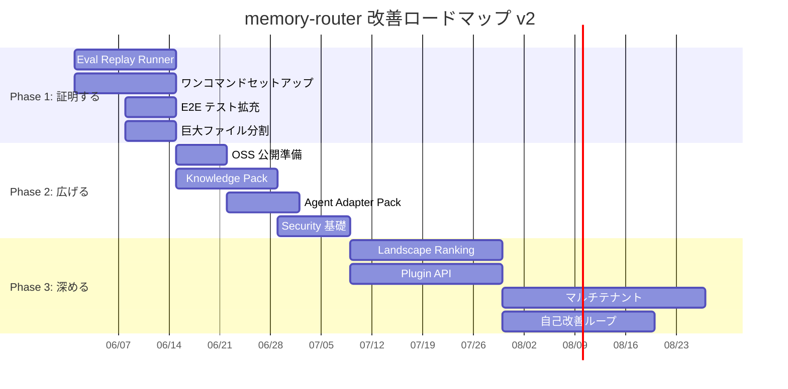

# memory-router 改善ロードマップ v2

> 作成日: 2026-05-30
> 前版: [project-value-improvement-roadmap.md](project-value-improvement-roadmap.md)（2026-05-25）
> 評価根拠: [project-evaluation-2026-05-30.md](project-evaluation-2026-05-30.md)

---

## 基本方針

v1 ロードマップの10施策のうち、4施策が実装済み・3施策が進行中に達した。

v2 では方針を更新する:

1. **「効果の証明」を最優先に据える** — 技術的独自性は既に十分。次に必要なのは「使うと何が改善されるか」の定量データ
2. **「導入の摩擦ゼロ」を第2優先に** — 技術的に深いほど、最初の体験が軽くないと使われない
3. **「共有と拡大」を第3優先に** — OSS 公開・コミュニティ形成・チーム利用を可能にする基盤
4. **品質の底上げは全フェーズで並行** — E2E テスト、巨大ファイル分割、エラーハンドリング統一

---

## v1 ロードマップ 達成状況

| # | 施策 | 状態 | 達成内容 | 残課題 |
|---:|---|:---:|---|---|
| 1 | Context 品質の評価エンジン | 🟡 | `compile_eval` MCP ツール、5軸 RadarChart UI、`context_compile_evals` テーブル | replay runner、before/after 比較、評価ケース定義 |
| 2 | Active-use feedback loop | ✅ | `used/not_used/off_topic/wrong` 記録、UI feedback ボタン、ranking 反映、`knowledge_usage_events` | regression watch の自動化 |
| 3 | Local appliance 化 | 🟡 | `init:project`、LaunchAgent/Windows Task 自動化、`doctor` 診断 | ワンコマンドセットアップ、self-heal |
| 4 | Knowledge pack import/export | ⬜ | — | 全体 |
| 5 | Agent integration 拡張 | 🟡 | Codex/Antigravity/Claude ログ同期、MCP 15ツール | Cursor/Cline adapter |
| 6 | Queue と蒸留の自律運用 | ✅ | Queue Supervisor、Priority Claim、pause/resume/retry、heartbeat 監視 | cost budget |
| 7 | Review/Approval workflow | ✅ | Landscape → Review Item → Candidate Draft → Approval Gate → Finalize | bulk operation |
| 8 | Security / privacy controls | ⬜ | — | 全体 |
| 9 | "Why this context?" explainability | 🟡 | Ranking trace 永続化、Trajectory panel、sandbox comparison | 落選理由 UI、compare view |
| 10 | Plugin / extension API | ⬜ | — | 全体 |

---

## 新ロードマップ: 3フェーズ構成

```
Phase 1: 証明する（Prove It）          ← 今ここから
Phase 2: 広げる（Open the Gate）
Phase 3: 深める（Go Deeper）
```

---

## Phase 1: 証明する（Prove It）

> 目的: memory-router を使うことで具体的に何が改善されるかを、定量データで示せるようにする。
> 期間目安: 2〜3週間

### 1-1. Context 評価 Replay Runner 🔴最優先

**v1 施策 #1 の残り部分。プロダクト価値の証明に直結する。**

現状: `compile_eval` で run 単位の主観評価（5軸 RadarChart）は記録できる。しかし、「memory-router あり/なし」「設定 A/B」「knowledge 追加前後」の系統的比較ができない。

開発物:

- [ ] 評価ケース定義フォーマット（JSONL / DB テーブル）
  - `goal`, `changeTypes`, `technologies`, `domains`
  - `expectedKnowledgeIds[]` — 出るべき knowledge
  - `forbiddenKnowledgeIds[]` — 出てはいけない knowledge
  - `baselineRunId` — 比較元の run
- [ ] `bun run eval:replay` CLI
  - 評価ケースを順に compile し、expected/forbidden/missing を判定
  - precision / recall / F1 を算出
  - degraded / no-content 率を記録
- [ ] before/after 比較レポート（CLI JSON + Admin UI）
  - baseline run vs current run の diff
  - 改善/悪化した knowledge の一覧
  - ranking 変更のインパクト可視化
- [ ] Admin UI の **Eval** ページ
  - 評価ケース管理
  - replay 実行ボタン
  - 時系列での品質推移グラフ

達成条件:

- `bun run eval:replay` で 10 件以上の評価ケースを実行し、precision/recall が出力される
- Admin UI で before/after 比較が視覚的に確認できる
- README に「実測データに基づく品質保証」の章を追加できる

期待効果:

- 「memory-router を使うと context 品質が X% 改善する」と言える
- ranking 変更の意思決定が数値に基づく
- OSS 公開時の訴求力が劇的に上がる

---

### 1-2. ワンコマンドセットアップ 🔴最優先

**v1 施策 #3 の強化版。導入障壁はプロダクト価値に直結する。**

現状: `git clone` → `bun install` → `docker compose up` → `cp .env.example .env` → `bun run db:migrate` → `bun run init:project` の6ステップ。PostgreSQL + pgvector + LLM + embedding の依存が重い。

開発物:

- [ ] `memory-router setup` 対話式ウィザード
  - OS 検出（macOS / Linux / Windows）
  - Docker / Bun の存在確認と導入案内
  - `.env` の対話式生成（LLM endpoint, embedding provider, repo path）
  - DB コンテナ起動 + migration + health check の一括実行
  - MCP 設定ファイルの自動生成（Claude Code / Antigravity / Cursor 向け）
- [ ] `doctor --fix` モード
  - 診断結果から修復可能な項目を自動修復
  - stale lock 解除、migration 適用、embedding リビルド
- [ ] SQLite fallback の検討と PoC
  - pgvector なしでも基本機能が動くモード
  - ベクトル検索なし（全文検索のみ）のグレースフルデグレード
- [ ] Docker-free モード の検討
  - Bun の SQLite ドライバ + ファイルベース運用
  - 最小構成: `bun install && bun run setup && bun run start:mcp`

達成条件:

- 新規ユーザーが clone → `bun run setup` → MCP 接続まで **5分以内** で完了できる
- Docker なしでも基本機能が動作する fallback がある
- `doctor --fix` が少なくとも 5 つの自動修復を実行できる

期待効果:

- 導入での離脱率が劇的に下がる
- 「面倒」→「5分で動く」への印象転換
- OSS 公開後のスター獲得に直結

---

### 1-3. E2E テスト拡充

**品質保証の最終レイヤー。現状 32 行は不十分。**

現状: `e2e/` に Playwright 設定はあるが、テストケースがほぼ空。156 のユニットテストは充実しているが、ユーザーフロー全体のカバーがない。

開発物:

- [ ] 主要ユーザーフローの E2E テスト
  - Overview ページのロードと主要メトリクス表示
  - Knowledge 一覧 → 詳細 → フィードバック送信
  - Compile 実行 → 結果表示 → RadarChart 評価
  - Queue ページの状態表示 → pause/resume
  - Graph ページのロードとコミュニティ表示
  - Source ページの Wiki ツリー表示
- [ ] MCP フルサイクル E2E
  - `initial_instructions` → `context_compile` → `compile_eval` → `register_candidate`
- [ ] CI への E2E 統合
  - verify ワークフローに E2E ステージ追加

達成条件:

- 主要 10 画面の smoke テストが CI で毎回実行される
- MCP ツール往復の E2E が通る

---

### 1-4. 巨大ファイル分割

**技術的負債の計画的解消。**

| ファイル | 現在のサイズ | 分割方針 |
|---|---|---|
| `context-compiler.service.ts` | 1,350行 / 45KB | query / ranking / budget / compose / diagnostics に分割 |
| `graph.page.tsx` | ~3,600行 / 120KB | community-panel / trajectory-panel / sandbox-panel / contradiction-panel を既存コンポーネント化済みの箇所から独立 |
| `settings.page.tsx` | ~3,600行 / 121KB | provider-settings / embedding-settings / distillation-settings / general-settings に分割 |

達成条件:

- 上記3ファイルが全て 500 行以下のサブモジュールに分割されている
- 既存テストが全て通る
- `bun run verify` がパスする

---

## Phase 2: 広げる（Open the Gate）

> 目的: OSS 公開・外部ユーザー獲得・チーム利用の基盤を作る。
> 期間目安: Phase 1 完了後 3〜4週間

### 2-1. OSS 公開準備 + コミュニティ形成

開発物:

- [ ] CONTRIBUTING.md の整備（開発環境構築、PR ルール、コード規約）
- [ ] Issue テンプレート（bug report / feature request / knowledge pack 共有）
- [ ] Discussion / Wiki の有効化
- [ ] GitHub Pages LP の最終調整
  - ライブデモ GIF / 動画
  - 「5分で始める」チュートリアル
  - ベンチマーク結果の掲載（Phase 1 で取得した eval データ）
- [ ] Product Hunt / Hacker News / Reddit 向けの launch 文
- [ ] 初期コントリビュータ向けの good-first-issue ラベル付け

達成条件:

- 外部コントリビュータが CONTRIBUTING.md だけで PR を出せる
- GitHub Pages にライブデモと評価データがある

---

### 2-2. Knowledge Pack Import/Export

**v1 施策 #4。知識を移植可能な資産にする。**

開発物:

- [ ] `memory-router export` CLI
  - `--repo <path>` / `--scope global` / `--status active`
  - 出力: JSON bundle（knowledge items + source links + tag definitions + metadata）
  - schema version、export 日時、source hash
- [ ] `memory-router import <bundle>` CLI
  - 差分 preview（new / updated / conflict）
  - conflict resolution 方針（skip / overwrite / merge）
  - dry-run モード
- [ ] bundle 検証
  - schema version 互換チェック
  - knowledge 重複検出（既存 dedupe サービス再利用）
- [ ] Admin UI の Import/Export ページ
  - bundle アップロード / ダウンロード
  - diff プレビュー

達成条件:

- `export → import` の往復で knowledge が保存される
- 異なるリポジトリ間で knowledge を共有できる
- bundle の schema version が管理されている

---

### 2-3. Agent Integration Adapter Pack

**v1 施策 #5。主要エージェントの統合ガイドを充実させる。**

開発物:

- [ ] Agent ごとの統合ガイド（Markdown）
  - Claude Code: MCP 設定 + CLAUDE.md テンプレート
  - Cursor: MCP 設定 + .cursor/rules テンプレート
  - Cline: MCP 設定手順
  - Gemini CLI / Antigravity: AGENTS.md テンプレート
  - VS Code + Continue: MCP 設定手順
- [ ] `memory-router generate:agent-config <agent>` CLI
  - 選択した agent の MCP 設定 JSON を自動生成
  - `initial_instructions` 出力を agent のルールファイル形式に変換
- [ ] Agent ごとの `initial_instructions` 最適化
  - agent の特性に合わせた指示調整（ツール呼び出し頻度、メモリ利用パターン）

達成条件:

- 主要5エージェントの統合ガイドがある
- `generate:agent-config` で設定ファイルが自動生成される

---

### 2-4. Security / Privacy Controls 基礎

**v1 施策 #8。企業利用への第一歩。**

開発物:

- [ ] Secret redaction
  - distillation 入力のスキャン（API key, token, password パターン）
  - redacted content の audit log 記録
- [ ] Provider routing policy
  - knowledge / source 内容を外部 LLM に送る前の許可チェック
  - `scope: private` な knowledge は local-llm のみ
- [ ] Audit export
  - `memory-router audit:export --from <date> --to <date> --format json`
  - コンプライアンス用のフル監査ログ出力

達成条件:

- API キーパターンが source に含まれていた場合、蒸留前に redact される
- private scope の knowledge が外部 provider に送信されない
- 監査ログが JSON でエクスポートできる

---

## Phase 3: 深める（Go Deeper）

> 目的: 差別化をさらに深め、エコシステムの中核としての地位を固める。
> 期間目安: 継続的

### 3-1. Landscape Production Ranking

**Knowledge Landscape の分析結果を production ranking に段階的に導入する。**

現状: observe → explain → replay まで実装済み。production ranking への接続は意図的に未実装。

開発物:

- [ ] Replay-validated ranking experiments
  - Attractor boost: strong_attractor community の knowledge に +5〜10% boost
  - Negative repulsion: negative_attractor_candidate を suppression candidate に
  - Used-baseline retention: 過去に used だった knowledge の下落を抑制
- [ ] A/B テスト基盤
  - compile 時に experiment flag で ranking バリアントを選択
  - eval:replay でバリアント間の比較
- [ ] 段階的ロールアウト
  - default off → env opt-in → eval 検証 → default on

達成条件:

- replay で ranking 変更の before/after が検証されている
- production で A/B テストが実行できる
- 少なくとも 1 つの ranking experiment が default on になっている

---

### 3-2. Plugin / Extension API

**v1 施策 #10。エコシステム拡張性。**

開発物:

- [ ] Source connector interface
  - Notion / Confluence / Google Docs / Slack からの知識取り込み
  - `SourceConnector` インターフェース定義
- [ ] Ranking policy hook
  - compile 時のカスタムランキングロジック差し込み
  - `RankingPolicy` インターフェース定義
- [ ] Provider adapter interface（既存の LLM multi-provider を公式 API 化）
- [ ] Export format hook
  - JSON 以外の bundle フォーマット対応（YAML, TOML, etc.）
- [ ] Project-local extension discovery
  - `.memory-router/extensions/` からのプラグイン自動読み込み

---

### 3-3. マルチテナント / チーム基盤

開発物:

- [ ] ユーザー認証（OAuth / SSO）
- [ ] ロールベースアクセス制御（viewer / editor / admin）
- [ ] チーム knowledge space
  - 個人 → チーム → 組織 の階層スコープ
- [ ] Approval workflow のチーム版
  - reviewer assignment
  - approval policy（2人承認、自動承認条件）
- [ ] ダッシュボードのマルチユーザー表示

---

### 3-4. 自己改善ループの完成

開発物:

- [ ] Feedback regression watch
  - `wrong` / `off_topic` の増加傾向を自動検出
  - Doctor に regression alert を追加
- [ ] Automatic appliesTo refinement
  - off_topic feedback から appliesTo の自動絞り込み候補を生成
  - review queue 経由で人間承認
- [ ] Knowledge quality auto-triage
  - 長期未使用 + source evidence 薄い knowledge の自動 review 候補化
  - deprecated 推奨の自動生成（人間承認必須）
- [ ] Compile quality SLO
  - precision/recall の閾値を設定
  - 閾値を下回ったら alert

---

## 全体タイムライン



---

## 推奨実行順（トップ5）

| 順位 | 施策 | 理由 |
|:---:|---|---|
| 🥇 | **Eval Replay Runner** | 全ての改善の計測基盤。これなしに他の施策の効果を証明できない |
| 🥈 | **ワンコマンドセットアップ** | 外部ユーザーの第一印象を決める。OSS 公開前に必須 |
| 🥉 | **E2E テスト拡充** | Phase 2 以降の開発速度を守る品質保険 |
| 4 | **OSS 公開準備** | Phase 1 の成果を市場にぶつけるタイミングを作る |
| 5 | **Knowledge Pack** | OSS コミュニティでの知識共有を可能にし、ネットワーク効果を生む |

---

## 判断基準

各施策の優先度は以下の4軸で評価する:

| 軸 | 重み | 説明 |
|---|:---:|---|
| **証明力** | 40% | memory-router の価値を定量的に示せるか |
| **導入性** | 25% | 新規ユーザーの導入障壁を下げるか |
| **拡張性** | 20% | 将来の機能追加を加速するか |
| **差別化** | 15% | 競合との差を広げるか |

施策の選択に迷ったら、この重み付けで判断する。
