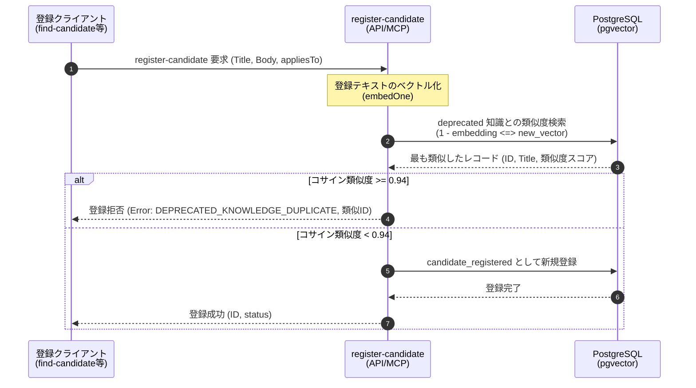

# Specification: register-candidate における非推奨知識との類似判定による重複登録防止

作成日: 2026-05-28  
ステータス: Draft (Review Required)  
著者: Antigravity & Userペア

---

## 1. 背景と目的

プロジェクトのデータ蒸留パイプラインにおいて、不要または陳腐化した知識は `deprecated`（非推奨）に設定し、エージェントのコンテキスト検索対象からアーカイブ（除外）する運用を行っています。

しかし、エージェントの実行ログから自動的に知識を抽出する `find-candidate` 等のツールが稼働すると、**「過去に意図して非推奨（deprecated）にしたものとほぼ同一の知識」が、再び新規の知識候補（candidate）として自動選出・再登録されてしまう問題（ゾンビ化問題）** が懸念されます。

本改修では、すべての知識候補の登録関所である **`register-candidate`** において、新規登録しようとする候補が「すでに非推奨化された既存の知識」と極めて類似している場合に登録を自動ブロックするガードレール機能を実装します。

---

## 2. 設計概要

### 2.1 ゲートウェイとしての `register-candidate` の役割
`find-candidate`（ログからの自動抽出）や他の経路からの手動登録を含め、すべての知識候補は最終的に `register-candidate` を通過して `knowledge_candidates` テーブルに保存されます。このため、この共通エンドポイントに類似判定ロジックを搭載することで、いかなる登録ルートからも漏れなく重複登録を防止（Single Source of Truthの維持）できます。

### 2.2 類似判定ロジックと閾値の設定
- **類似度指標**: テキスト全体のベクトル表現（Embedding）の **コサイン類似度**
- **比較対象**: データベース内の `knowledge_items` テーブルのうち、`status = 'deprecated'` であるすべてのレコード
- **類似度判定の閾値**: **`0.94`**
  - **解説**: 0.94 という極めて高い閾値を設定することで、「完全に同じ趣旨、またはほぼ同一の言い回しの知識」のみをブロックし、キーワードの一部が重なるだけの有用な別知識の登録を阻害（誤検知）しないように保護します。

---

## 3. 処理フロー

新規の知識候補が `register-candidate` に到達した際、以下のステップで判定を行います。



---

## 4. データベースクエリの実装イメージ

PostgreSQL (`pgvector`) を使用した、類似度判定の SQL 実装イメージは以下の通りです。

```sql
-- 閾値 0.94 を超える、最も類似した非推奨の知識を1件検索
SELECT id, title, (1 - (embedding <=> :queryEmbedding)) AS similarity
FROM knowledge_items
WHERE status = 'deprecated' AND embedding IS NOT NULL
ORDER BY embedding <=> :queryEmbedding
LIMIT 1;
```

---

## 5. ガードレールと検討事項（リスク対策）

1. **類似度判定の対象**:
   - `status = 'deprecated'` の項目だけでなく、将来的に `status = 'active'`（稼働中）や `status = 'draft'`（下書き）の知識との重複も防止対象に含めるべきか、レビューで検討します。
2. **誤検知（False Positive）の防止**:
   - 類似度閾値を `0.94` 未満に下げてしまうと、一般的な語彙（例：「try-catchは正しく使用する」など）の重複によって新規登録が誤って妨げられるリスクがあります。初回リリース時は `0.94` を厳守し、運用の状況に応じて調整可能にします。
3. **登録拒否時のエージェントへの通知**:
   - 自動抽出パイプラインにおいて登録が拒否された場合、エントリのステータスを `skipped_by_deprecated_similarity` 等に設定し、どの既存非推奨IDと重複したかを明確にトレースできるようにします。

---

## 6. 検証プラン

### 6.1 自動テストケース (Unit Test)
1. **正常登録ケース**:
   - 既存の非推奨知識と類似していないテキスト（類似度 < 0.94）を登録し、正常に `candidate_registered` となること。
2. **重複ブロックケース**:
   - 既存の非推奨知識と全く同じタイトル・本文、または極めて類似した表現（類似度 >= 0.94）を登録し、`DEPRECATED_KNOWLEDGE_DUPLICATE` エラーで登録がブロックされること。
3. **境界条件ケース**:
   - 類似度が `0.93` や `0.95` のボーダーラインのテキストを用い、`0.94` を境に正しく判別が行われること。
